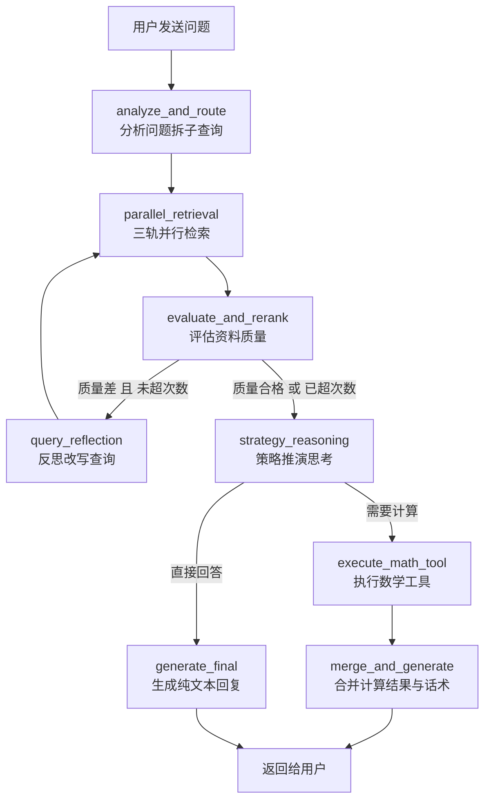

# ai_app4 零基础学习指南

> 面向不懂 Python 和 AI 应用开发的新手，手把手带你读懂 ai_app4 的代码结构、运行逻辑和设计思路。
>
> 版本: 1.0 | 日期: 2026-05-17

---

## 目录

1. [认识 ai_app4](#一认识-ai_app4)
2. [核心概念扫盲](#二核心概念扫盲)
3. [完整流程图解](#三完整流程图解)
4. [文件职责地图](#四文件职责地图)
5. [关键代码走读](#五关键代码走读)
6. [运行与测试指南](#六运行与测试指南)
7. [学习路线图与 FAQ](#七学习路线图与-faq)

---

## 一、认识 ai_app4

### 1.1 一句话概括

**ai_app4 是一个面向全球资产配置与宏观经济分析的 AI 智能助理。**

你可以把它想象成一个"金融投资顾问机器人"：你问它"英伟达最新财报怎么样"、"美联储下次加息概率多大"、"我手里 10 万块该怎么配置"，它会先查资料、再思考、最后给你一个专业的回答。

### 1.2 它能做什么

- **知识问答**：回答关于股票、宏观经济、量化策略的问题
- **实时数据查询**：通过 Yahoo Finance、FRED API 获取股价、PE、CPI 等数据
- **网络搜索**：获取最新新闻和市场动态
- **数学计算**：凯利公式、网格交易成本、组合回撤、复利计算等
- **多轮对话**：记得你上一轮说了什么，可以追问

### 1.3 它不能做什么

- **不是炒股软件**：不能下单交易
- **不能保证盈利**：所有分析仅供参考
- **不是实时行情终端**：股价数据有延迟，且依赖第三方 API

### 1.4 它和 ai_app1/2/3 的关系

整个 AnalyzerGP 项目里有 4 个 AI 应用，你可以把它们理解为"同一家公司里的 4 个产品"：

| 产品 | 特点 | 比喻 |
|------|------|------|
| ai_app1 | 一条笔直的流水线：检索 → 生成 | 工厂流水线，每个产品走同样的步骤 |
| ai_app2 | 用 LangGraph 把流水线改画成流程图 | 流水线的升级版，但还是只能走固定路线 |
| ai_app3 | 增加了自我判断能力，检索不好会自动改写重试 | 聪明的质检员，发现问题会退回重做 |
| **ai_app4** | **在 ai_app3 基础上，增加了实时数据、网络搜索、数学工具、商业级管控** | **一个完整的智能投资顾问团队** |

> 学习 ai_app4 之前，你**不需要**先学懂 ai_app1/2/3。本文档会从头讲起。

### 1.5 技术栈一览

ai_app4 用到了这些技术（不懂没关系，后面会解释）：

- **Python**：编程语言
- **FastAPI**：Web 框架，用来接收用户请求
- **LangGraph**：AI 工作流程编排框架
- **ChromaDB**：向量数据库，存储知识文档
- **Tantivy**：搜索引擎，做关键词匹配
- **sentence-transformers**：把文字转换成向量（Embedding）
- **CrossEncoder**：对检索结果做精排
- **OpenAI-compatible LLM**：大语言模型，负责理解问题和生成回答

---

## 二、核心概念扫盲

在深入代码之前，你需要理解 8 个核心概念。我会用尽量通俗的语言解释。

### 2.1 RAG：检索增强生成

**问题**：AI 大模型有时会"胡说八道"，编造不存在的数据。

**解决方案 RAG**：让 AI 在回答问题之前，**先去知识库里查资料**，然后基于查到的资料来回答。

```
传统 AI：用户提问 → AI 凭记忆回答 → 可能瞎编
RAG：    用户提问 → 去知识库查资料 → 基于资料回答 → 更可靠
```

在 ai_app4 里，知识库存储在 [`ai_app1/data/`](ai_app1/data/) 目录下（项目统一数据目录），包含财报、宏观报告等文档。

### 2.2 Agent：智能体

**Agent** 不只是"回答问题"，而是**能自主做决策、调用工具、修正错误的程序**。

打个比方：
- 普通 AI 像一个"只会背书的考生"，你问什么它答什么
- Agent 像一个"有行动能力的助理"，发现需要计算时会拿起计算器，发现资料不够时会重新搜索

ai_app4 就是一个 Agent：它会分析问题、检索资料、评估质量、改写查询、调用计算工具，整个过程不需要人工干预。

### 2.3 LangGraph 与 StateGraph

**LangGraph** 是一个 Python 库，用来把 AI 的工作流程画成一张**流程图**。

**StateGraph** 是 LangGraph 里的核心概念，意思是：
- 整个流程图里所有步骤共享一个**"状态本"**（State）
- 每个步骤可以读取状态本里的信息，也可以往里面写信息
- 下一个步骤能看到上一个步骤写的内容

类比：像是一个接力赛，每个选手（节点）跑完后，把接力棒（状态）传给下一个选手。

### 2.4 Node：节点

流程图里的**每一个处理步骤**叫做一个 Node（节点）。

ai_app4 里有 8 个节点，每个节点都是一个 Python 异步函数：

| 节点名 | 作用 |
|--------|------|
| `analyze_and_route` | 分析用户问题，拆解成多个子问题 |
| `parallel_retrieval` | 同时去多个地方查资料 |
| `evaluate_and_rerank` | 评估查到的资料质量好不好 |
| `query_reflection` | 资料质量不好时，改写问题重新查 |
| `strategy_reasoning` | 主模型深度思考，决定怎么回答 |
| `execute_math_tool` | 执行数学计算工具 |
| `merge_and_generate` | 把计算结果和文字回答合并 |
| `generate_final` | 生成最终文字回复 |

每个节点的代码都在 [`ai_app4/graph/nodes.py`](ai_app4/graph/nodes.py) 里。

### 2.5 Edge：边

**边**就是节点之间的**连接线**，表示"做完 A 之后去做 B"。

ai_app4 里有两类边：
- **普通边**：固定走向，比如分析完一定去检索
- **条件边**：根据判断结果走向不同分支，比如评估质量好就继续，质量差就反思

条件边的代码在 [`ai_app4/graph/conditional_edges.py`](ai_app4/graph/conditional_edges.py) 里。

### 2.6 Tool Calling：工具调用

当 AI 发现需要**精确计算**时（比如算凯利公式），它不会自己口算，而是**调用一个专门的计算函数**。

流程：
1. AI 在思考过程中输出一个 JSON 指令：`TOOL_CALL: {"tool_name": "kelly_criterion_calc", ...}`
2. 程序解析这个指令，提取函数名和参数
3. 调用对应的 Python 函数
4. 把计算结果返回给 AI

ai_app4 的数学工具在 [`ai_app4/service/math_tools.py`](ai_app4/service/math_tools.py) 里。

### 2.7 MemorySaver：记忆保存

ai_app4 能记住你之前说过的话，靠的是 **MemorySaver**。

- 每个用户有一个 `user_id`
- LangGraph 用 `thread_id`（就是 `user_id`）来保存对话状态
- 下一轮对话时，自动加载之前的状态，包括历史记录、摘要等

代码在 [`ai_app4/graph/builder.py`](ai_app4/graph/builder.py:101) 里：`graph = builder.compile(checkpointer=memory)`

### 2.8 三轨检索：本地 + API + 搜索

ai_app4 最大的特色是**同时从三个渠道查资料**：

| 轨道 | 数据源 | 查什么 | 成本 |
|------|--------|--------|------|
| Track A | 本地知识库（ChromaDB + Tantivy） | 历史财报、宏观报告 | 免费 |
| Track B | Yahoo Finance / FRED API | 实时股价、PE、CPI 等 | 按次计费 |
| Track C | Tavily 网络搜索 | 最新新闻、市场动态 | 按次计费 |

代码在 [`ai_app4/service/retrieval/three_track_retriever.py`](ai_app4/service/retrieval/three_track_retriever.py) 里。

---

## 三、完整流程图解

当一个用户发送消息时，ai_app4 内部经历了什么？

### 3.1 流程图



### 3.2 一步一步详解

#### 第 1 步：分析问题（analyze_and_route）

程序收到用户消息后，首先做几件事：

1. **时效性检测**：检查问题里有没有"今天""最新""实时"这类词。如果有，后面会启用 Track B/C 去查实时数据。
2. **实体提取**：从问题里找出股票代码（如 NVDA）、宏观指标（如 CPI）、日期等。
3. **子查询拆解**：如果一句话问了多个问题，拆成多个子问题。比如"英伟达和特斯拉哪个更好"拆成"英伟达怎么样"和"特斯拉怎么样"。
4. **中英文翻译**：把中文里的金融术语追加英文，提高检索命中率。

> 代码位置：[`ai_app4/graph/nodes.py`](ai_app4/graph/nodes.py:196) `analyze_and_route_node` 函数

#### 第 2 步：并行检索（parallel_retrieval）

根据第 1 步的分析结果，同时从三个轨道查资料：

- **Track A（本地）**：用 HybridRetriever 查向量数据库和 BM25 索引
- **Track B（API）**：如果问题里有股票代码或宏观指标，调用 Yahoo Finance 或 FRED API
- **Track C（搜索）**：如果时效性高，调用 Tavily 网络搜索

三个轨道用 `asyncio.gather` **同时执行**，取最快的结果。

> 代码位置：[`ai_app4/graph/nodes.py`](ai_app4/graph/nodes.py) `parallel_retrieval_node` 函数

#### 第 3 步：评估质量（evaluate_and_rerank）

查到的资料不一定有用，需要评估：

1. **CrossEncoder 精排**：用一个专门的模型给每篇资料打分，分数越高表示和用户问题越相关
2. **提取 top_ce**：最高分的那个分数，叫做 `top_ce`
3. **计算 confidence**：综合 top_ce 和其他因素，算出一个总体置信度

> 代码位置：[`ai_app4/graph/nodes.py`](ai_app4/graph/nodes.py) `evaluate_and_rerank_node` 函数

#### 第 4 步：条件分支 — 反思 or 继续？

这是第一个**条件判断**：

```
if top_ce < 0.35 且 已经检索的次数 < 2:
    → 进入 query_reflection（反思改写）
else:
    → 进入 strategy_reasoning（策略推演）
```

**为什么要反思？** 如果查到的资料和用户问题不太相关（top_ce 太低），说明查询词可能不准确。这时候让 AI 重新改写查询词，再查一遍。

**最多反思 2 次**：防止无限循环消耗资源。

> 代码位置：[`ai_app4/graph/conditional_edges.py`](ai_app4/graph/conditional_edges.py:9) `after_evaluate` 函数

#### 第 5 步：反思改写（query_reflection）

AI 分析为什么上次检索质量不好，然后用更专业的金融术语改写查询。

比如用户问"英伟达最近咋样"，第一次检索没查到好结果，反思后可能改写成"NVIDIA Corporation NVDA latest quarterly earnings revenue guidance"。

改写完后，**回到第 2 步重新检索**。

> 代码位置：[`ai_app4/graph/nodes.py`](ai_app4/graph/nodes.py) `query_reflection_node` 函数

#### 第 6 步：策略推演（strategy_reasoning）

资料质量过关后，主模型（通常是 MiniMax 或 OpenAI）开始深度思考：

1. 阅读检索到的所有资料
2. 结合对话历史，理解用户意图
3. 判断是否需要调用数学工具
4. 如果需要，输出 `TOOL_CALL` JSON 指令
5. 如果不需要，直接构思回答内容

> 代码位置：[`ai_app4/graph/nodes.py`](ai_app4/graph/nodes.py) `strategy_reasoning_node` 函数

#### 第 7 步：条件分支 — 调用工具 or 直接生成？

第二个**条件判断**：

```
if needs_tool == True:
    → 进入 execute_math_tool（执行工具）
else:
    → 进入 generate_final（直接生成回复）
```

> 代码位置：[`ai_app4/graph/conditional_edges.py`](ai_app4/graph/conditional_edges.py:38) `after_strategy` 函数

#### 第 8 步：执行数学工具（execute_math_tool）

解析 `TOOL_CALL` 指令，提取工具名和参数，调用对应的 Python 函数。

ai_app4 内置了 4 个数学工具：

| 工具名 | 功能 |
|--------|------|
| `kelly_criterion_calc` | 凯利公式：计算最优仓位比例 |
| `grid_trading_cost_estimator` | 网格交易：估算交易成本和网格参数 |
| `portfolio_drawdown_estimator` | 组合回撤：估算最坏情况下亏多少 |
| `compound_growth_calculator` | 复利计算：算几年后资产变成多少 |

> 代码位置：[`ai_app4/service/math_tools.py`](ai_app4/service/math_tools.py)

#### 第 9 步：合并生成（merge_and_generate）

把数学工具的**计算结果**和 LLM 的**文字分析**合并成一份完整的报告。

比如：
```
根据凯利公式计算，您的最优仓位为 23.5%...
[这里插入具体数字和表格]

基于以上计算，建议采取保守策略...
[这里插入 AI 的文字分析]
```

> 代码位置：[`ai_app4/graph/nodes.py`](ai_app4/graph/nodes.py) `merge_and_generate_node` 函数

#### 第 10 步：返回给用户

最终回复会通过 SSE（Server-Sent Events）流式返回给前端：

1. 先推送 `trace`：告诉前端整个执行过程经过了哪些节点
2. 再逐字推送 `content`：模拟打字机效果，一个字一个字显示
3. 最后推送 `done`：表示流结束

如果启用了**来源标注**，回复末尾会注明数据来自哪里：
```
📎 数据来源：本地知识库、实时金融数据 API
```

如果启用了**免责声明**，回复末尾会追加：
```
⚠️ 免责声明：以上内容仅供参考，不构成任何投资建议...
```

> 代码位置：[`ai_app4/api/chat.py`](ai_app4/api/chat.py)

---

## 四、文件职责地图

### 4.1 目录结构总览

```
ai_app4/
├── main.py                 # 程序入口
├── lifespan.py             # 启动和关闭时要做什么
├── core/                   # 核心配置和容器
│   ├── config.py           # 配置项
│   ├── container.py        # 依赖注入容器
│   └── context.py          # 全局上下文（避免循环导入）
├── graph/                  # LangGraph 流程图
│   ├── state.py            # 状态定义
│   ├── builder.py          # 搭流程图
│   ├── nodes.py            # 8 个节点实现
│   └── conditional_edges.py# 条件分支逻辑
├── api/                    # 对外接口
│   └── chat.py             # /chat 和 /chat/json
├── service/                # 业务服务
│   ├── math_tools.py       # 4 个数学计算工具
│   ├── tools.py            # 工具注册
│   ├── cache.py            # 内存缓存
│   ├── quota.py            # API 配额管理
│   ├── datasources/        # 外部数据源
│   │   ├── yahoo_finance.py
│   │   ├── fred_api.py
│   │   └── tavily_search.py
│   └── retrieval/
│       └── three_track_retriever.py  # 三轨融合检索
├── static/                 # 网页前端
│   └── index.html
└── tests/                  # 测试文件
    ├── test_phase2_nodes.py
    ├── test_phase3_nodes.py
    ├── test_phase4_nodes.py
    └── test_commercial_components.py
```

### 4.2 文件职责表

| 文件 | 职责 | 新手应该什么时候看 |
|------|------|------------------|
| [`main.py`](ai_app4/main.py) | FastAPI 入口，创建 app，挂载路由 | 第 1 天 |
| [`lifespan.py`](ai_app4/lifespan.py) | 启动时加载配置、构建容器、初始化三轨检索器、注册工具、预热模型 | 第 2 天 |
| [`core/config.py`](ai_app4/core/config.py) | 所有配置项的默认值，比如 top_ce 阈值、权重、API Key | 第 2 天 |
| [`core/container.py`](ai_app4/core/container.py) | 继承框架的容器，组装所有组件 | 第 3 天 |
| [`core/context.py`](ai_app4/core/context.py) | 全局变量，让节点能获取容器和配置 | 第 3 天 |
| [`graph/state.py`](ai_app4/graph/state.py) | 定义状态本里有哪些字段 | 第 2 天 |
| [`graph/builder.py`](ai_app4/graph/builder.py) | 把 8 个节点和条件边搭成一张图 | 第 3 天 |
| [`graph/nodes.py`](ai_app4/graph/nodes.py) | 8 个节点的具体实现，代码量最大 | 第 4~7 天 |
| [`graph/conditional_edges.py`](ai_app4/graph/conditional_edges.py) | 两个条件判断函数 | 第 3 天 |
| [`api/chat.py`](ai_app4/api/chat.py) | 接收用户请求，调用流程图，返回 SSE 流 | 第 4 天 |
| [`service/math_tools.py`](ai_app4/service/math_tools.py) | 4 个纯 Python 计算函数 | 第 5 天 |
| [`service/tools.py`](ai_app4/service/tools.py) | 把 math_tools 注册到工具注册表 | 第 5 天 |
| [`service/cache.py`](ai_app4/service/cache.py) | 内存缓存，带 TTL 过期 | 第 6 天 |
| [`service/quota.py`](ai_app4/service/quota.py) | 按租户/用户/数据源限制 API 调用次数 | 第 6 天 |
| [`service/datasources/*.py`](ai_app4/service/datasources/) | 三个外部数据源的接入代码 | 第 7 天 |
| [`service/retrieval/three_track_retriever.py`](ai_app4/service/retrieval/three_track_retriever.py) | 三轨融合检索的核心逻辑 | 第 7 天 |

---

## 五、关键代码走读

这一章带你逐行理解核心文件。不需要你完全看懂每一行，重点是理解**设计思路**。

### 5.1 main.py —— 程序入口

[`ai_app4/main.py`](ai_app4/main.py) 只有 37 行，非常简单：

```python
app = FastAPI(
    title="ai_app4 — Wealth AI Agent",
    lifespan=lifespan,  # 启动和关闭时执行 lifespan 里的逻辑
)

app.include_router(chat_router, prefix="/api")
```

**关键点**：
- `lifespan=lifespan`：告诉 FastAPI，启动时要执行 [`lifespan.py`](ai_app4/lifespan.py) 里的启动逻辑
- `app.include_router(chat_router, prefix="/api")`：把所有聊天相关的接口挂载到 `/api` 前缀下

### 5.2 lifespan.py —— 启动时做什么

[`ai_app4/lifespan.py`](ai_app4/lifespan.py) 是程序启动的"初始化清单"。

启动流程（按顺序）：

1. **加载配置**：`WealthSettings()` 读取环境变量和 `.env` 文件
2. **构建容器**：`WealthContainer.from_settings(settings)` 组装所有组件（Embedding 模型、检索器、LLM 客户端等）
3. **初始化缓存**：`MemoryCache(default_ttl=300)` 创建一个内存缓存，默认 5 分钟过期
4. **初始化配额管理器**：`QuotaManager()` 限制每个用户每天能调用多少次外部 API
5. **初始化三轨检索器**：如果启用了 `three_track_enabled`，把 Yahoo Finance、FRED、Tavily 三个数据源组装起来
6. **注册数学工具**：`register_wealth_tools()` 让 LLM 能调用计算工具
7. **预热模型**：调用所有 `Warmupable` 组件的 `warmup()`，避免第一个请求卡半天

```python
@asynccontextmanager
async def lifespan(app: FastAPI):
    # 1. 配置
    settings = WealthSettings()
    # 2. 容器
    container = WealthContainer.from_settings(settings)
    # 3~5. 缓存、配额、三轨检索器
    cache = MemoryCache(default_ttl=300)
    quota_manager = QuotaManager()
    # ...
    # 6. 注册工具
    register_wealth_tools()
    # 7. 预热
    for target in container.warmup_targets():
        target.warmup()
    yield  # 到这里，FastAPI 开始接收请求
    # 关闭时的清理逻辑（目前为空）
```

### 5.3 core/config.py —— 配置系统

[`ai_app4/core/config.py`](ai_app4/core/config.py) 定义了 `WealthSettings` 类，继承自框架的 `RAGSettings`。

你可以把它理解为一个**"配置说明书"**，所有可调参数都在这里：

```python
class WealthSettings(RAGSettings):
    active_domain: str = "wealth"           # 领域：wealth（覆盖默认的 android）
    reflection_threshold: float = 0.35      # top_ce 低于 0.35 就触发反思
    max_loop_count: int = 2                 # 最多反思 2 次
    track_a_weight: float = 1.0             # 本地检索权重
    track_b_weight: float = 0.95            # 金融 API 权重
    track_c_weight: float = 0.85            # 网络搜索权重
    yahoo_finance_enabled: bool = True      # 是否启用 Yahoo Finance
    tavily_search_enabled: bool = False     # 是否启用 Tavily（需要 API Key）
```

**环境变量覆盖**：
- 基类字段用 `RAG_*` 前缀，比如 `RAG_LLM_API_KEY=xxx`
- ai_app4 专属字段用 `WEALTH_*` 前缀，比如 `WEALTH_TAVILY_API_KEY=xxx`

配置文件位置：[`ai_app4/.env.example`](ai_app4/.env.example)

### 5.4 core/context.py —— 全局上下文

[`ai_app4/core/context.py`](ai_app4/core/context.py) 是一个**简单的全局变量仓库**。

**为什么要这个文件？**

因为 LangGraph 的节点（`nodes.py`）需要用到容器和配置，但如果直接 `from ai_app4.main import app` 会**循环导入**（main 导入 nodes，nodes 导入 main，形成死循环）。

**解决方案**：在 `lifespan.py` 启动时把对象"存"到 `context.py`，节点运行时从 `context.py` "取"。

```python
# lifespan.py 启动时
context.set_container(container)
context.set_settings(settings)

# nodes.py 节点运行时
container = context.get_container()
settings = context.get_settings()
```

### 5.5 graph/state.py —— 状态本里有什么

[`ai_app4/graph/state.py`](ai_app4/graph/state.py) 定义了 `WealthState`，这是整个流程图共享的**"公共账本"**。

每个节点函数接收 `state`，返回一个 `dict`，表示要更新的字段。

核心字段：

| 字段 | 谁写入 | 含义 |
|------|--------|------|
| `user_message` | API 层 | 用户当前说的话 |
| `time_sensitive` | analyze_and_route | 是否涉及时效性 |
| `entities` | analyze_and_route | 提取的股票代码、指标等 |
| `sub_queries` | analyze_and_route | 拆解后的子问题 |
| `retrieved_context` | parallel_retrieval | 查到的资料拼接文本 |
| `top_ce` | evaluate_and_rerank | 检索质量最高分 |
| `confidence` | evaluate_and_rerank | 综合置信度 |
| `needs_tool` | strategy_reasoning | 是否需要计算工具 |
| `tool_calls` | strategy_reasoning | 待调用的工具列表 |
| `math_result` | execute_math_tool | 计算结果 |
| `reply` | merge_and_generate / generate_final | 最终回复 |
| `history` | API 层 / save 逻辑 | 对话历史 |
| `trace` | 所有节点 | 执行轨迹 |

### 5.6 graph/builder.py —— 搭流程图

[`ai_app4/graph/builder.py`](ai_app4/graph/builder.py) 把 8 个节点和条件边组装成一张完整的图。

```python
builder = StateGraph(WealthState)

# 注册节点
builder.add_node("analyze_and_route", analyze_and_route_node)
builder.add_node("parallel_retrieval", parallel_retrieval_node)
# ... 共 8 个

# 固定边
builder.set_entry_point("analyze_and_route")
builder.add_edge("analyze_and_route", "parallel_retrieval")

# 条件边 1：评估后决定反思还是继续
builder.add_conditional_edges(
    "evaluate_and_rerank",
    after_evaluate,
    {"reflection": "query_reflection", "strategy": "strategy_reasoning"}
)

# 条件边 2：策略推演后决定调用工具还是直接生成
builder.add_conditional_edges(
    "strategy_reasoning",
    after_strategy,
    {"tool": "execute_math_tool", "final": "generate_final"}
)

# 编译，加上 MemorySaver 实现对话记忆
graph = builder.compile(checkpointer=MemorySaver())
```

### 5.7 graph/conditional_edges.py —— 条件判断

[`ai_app4/graph/conditional_edges.py`](ai_app4/graph/conditional_edges.py) 只有两个函数，但它们是**整个系统的决策大脑**。

**after_evaluate**：检索评估后的路由

```python
def after_evaluate(state):
    top_ce = state.get("top_ce", 0.0)
    iterations = state.get("retrieval_iterations", 0)
    threshold = 0.35  # 可配置
    max_loop = 2      # 最多 2 次

    if top_ce < threshold and iterations < max_loop:
        return "reflection"   # 去反思
    return "strategy"         # 去策略推演
```

**after_strategy**：策略推演后的路由

```python
def after_strategy(state):
    if state.get("needs_tool", False):
        return "tool"   # 去执行工具
    return "final"      # 直接生成回复
```

### 5.8 api/chat.py —— 对外接口

[`ai_app4/api/chat.py`](ai_app4/api/chat.py) 提供了两个接口：

| 接口 | 用途 | 返回格式 |
|------|------|----------|
| `POST /api/chat` | 正常聊天 | SSE 流式（逐字显示） |
| `POST /api/chat/json` | 调试 / 低延迟场景 | 一次性 JSON |

**SSE 流式响应的事件类型**：

```json
// 第 1 条：执行轨迹
{"type": "trace", "data": [...], "latency_ms": 1234.5}

// 第 2~N 条：逐字内容
{"type": "content", "data": "A"}
{"type": "content", "data": "B"}

// 最后一条：结束标记
{"type": "done"}
```

**关键逻辑**：

1. 用 `graph.get_state(config)` 加载该用户之前的状态
2. 组装 `input_state`（把用户消息和之前的历史合并）
3. `await graph.ainvoke(input_state, config=config)` 执行整个流程图
4. 拿到 `result` 后，把 `reply` 逐字推送给前端

### 5.9 service/math_tools.py —— 数学工具箱

[`ai_app4/service/math_tools.py`](ai_app4/service/math_tools.py) 是纯 Python 函数，**不依赖任何外部 API**。

以**凯利公式**为例：

```python
def kelly_criterion_calc(win_rate, avg_gain_pct, avg_loss_pct, current_capital):
    """
    凯利公式：f* = (p*b - q) / b
    p = 胜率, q = 败率 = 1-p
    b = 平均盈利/平均亏损
    """
    p = win_rate
    q = 1 - p
    b = avg_gain_pct / avg_loss_pct if avg_loss_pct != 0 else 0

    kelly_fraction = (p * b - q) / b if b != 0 else 0
    optimal_fraction = max(0, min(kelly_fraction, 1))  # 限制在 0~1

    return {
        "optimal_fraction": round(optimal_fraction, 4),
        "recommended_position": round(current_capital * optimal_fraction, 2),
        "half_kelly_position": round(current_capital * optimal_fraction * 0.5, 2),
    }
```

所有工具函数返回 `dict`，包含计算结果和 `warning` 字段。

### 5.10 service/cache.py 与 quota.py —— 缓存和配额

**MemoryCache**（[`service/cache.py`](ai_app4/service/cache.py)）：
- 纯内存字典 + `asyncio.Lock` 保证线程安全
- 支持 TTL（Time To Live），过期自动失效
- 适用：股价缓存 5 分钟、宏观指标缓存 1 小时

**QuotaManager**（[`service/quota.py`](ai_app4/service/quota.py)）：
- 按 `tenant_id + user_id + source_name` 三级维度追踪
- 支持**硬配额**（超限拒绝）和**软配额**（超限警告但允许）
- 默认配置：
  - Tavily：日硬 50 / 日软 40 / 小时 10
  - Yahoo Finance：日硬 500 / 日软 400 / 小时 100
  - FRED：日硬 200 / 日软 150 / 小时 50

---

## 六、运行与测试指南

### 6.1 环境准备

1. **安装 uv**（Python 包管理器）：
   ```bash
   curl -LsSf https://astral.sh/uv/install.sh | sh
   ```

2. **安装依赖**：
   ```bash
   uv sync
   ```

3. **配置环境变量**：
   ```bash
   cp ai_app4/.env.example ai_app4/.env
   # 编辑 ai_app4/.env，填入 API Key
   ```

### 6.2 构建知识库索引（首次运行必需）

```bash
uv run python -m domains.wealth.scripts.init_wealth_db
```

这会读取 [`domains/wealth/data/`](domains/wealth/data/) 下的文档，构建向量索引和 BM25 索引。

### 6.3 启动 ai_app4

```bash
uv run python -m uvicorn ai_app4.main:app --host 0.0.0.0 --port 8004
```

启动后访问：
- 健康检查：`http://localhost:8004/health`
- API 文档：`http://localhost:8004/docs`
- Web 界面：`http://localhost:8004/ui`

### 6.4 测试命令

```bash
# 阶段二测试（查询拆解、并发检索）
uv run python -m ai_app4.tests.test_phase2_nodes

# 阶段三测试（评估、反思、条件边）
uv run python -m ai_app4.tests.test_phase3_nodes

# 阶段四测试（数学工具、工具调用）
uv run python -m ai_app4.tests.test_phase4_nodes

# 商业组件测试（缓存、配额、三轨检索）
uv run python -m ai_app4.tests.test_commercial_components

# 全局冒烟测试
uv run python scripts/verify_refactor.py
```

### 6.5 .env 配置说明

打开 [`ai_app4/.env.example`](ai_app4/.env.example)，你需要配置：

| 变量 | 必填 | 说明 |
|------|------|------|
| `RAG_LLM_API_KEY` | 是 | LLM API Key（MiniMax / OpenAI） |
| `RAG_LLM_BASE_URL` | 是 | LLM API 地址 |
| `WEALTH_TAVILY_API_KEY` | 否 | Tavily 搜索 API Key（如需启用网络搜索） |
| `WEALTH_FRED_API_KEY` | 否 | FRED 宏观数据 API Key |

---

## 七、学习路线图与 FAQ

### 7.1 推荐学习顺序（7 天计划）

| 天数 | 学习内容 | 目标 |
|------|----------|------|
| 第 1 天 | 读完本文档第 1~3 章 | 理解 ai_app4 是什么、能做什么 |
| 第 2 天 | 看 [`main.py`](ai_app4/main.py)、[`lifespan.py`](ai_app4/lifespan.py)、[`config.py`](ai_app4/core/config.py)、[`state.py`](ai_app4/graph/state.py) | 知道程序怎么启动、状态里有什么 |
| 第 3 天 | 看 [`builder.py`](ai_app4/graph/builder.py)、[`conditional_edges.py`](ai_app4/graph/conditional_edges.py)、[`context.py`](ai_app4/core/context.py) | 理解流程图怎么搭、分支怎么判断 |
| 第 4 天 | 看 [`api/chat.py`](ai_app4/api/chat.py)、[`nodes.py`](ai_app4/graph/nodes.py) 的前 3 个节点 | 理解请求怎么进来、分析节点和检索节点 |
| 第 5 天 | 看 [`nodes.py`](ai_app4/graph/nodes.py) 的后 5 个节点、[`math_tools.py`](ai_app4/service/math_tools.py) | 理解评估、反思、策略、工具、生成 |
| 第 6 天 | 看 [`cache.py`](ai_app4/service/cache.py)、[`quota.py`](ai_app4/service/quota.py)、[`tools.py`](ai_app4/service/tools.py) | 理解商业级管控 |
| 第 7 天 | 看 [`three_track_retriever.py`](ai_app4/service/retrieval/three_track_retriever.py)、[`datasources/*.py`](ai_app4/service/datasources/) | 理解三轨检索和数据源 |

### 7.2 常见问题

**Q1：我不懂 Python，能看懂这个项目的代码吗？**

A：可以。本文档就是为零基础写的。建议你配合一个 AI 编程助手（比如 Roo / Cursor），遇到不懂的语法就问它。

**Q2：为什么同一个项目里有 4 个 app？**

A：这是项目的"进化史"。ai_app1 是最简单的版本，ai_app4 是最复杂的版本。它们共用底层的 `rag_framework` 框架，但上层逻辑完全不同。

**Q3：ai_app4 和 ai_app3 有什么区别？**

A：ai_app3 面向 Android 开发问答，ai_app4 面向金融投资分析。ai_app4 增加了实时数据、网络搜索、数学工具、来源标注、合规声明、配额管理等商业级能力。

**Q4：为什么节点之间要用 `context.py` 传对象，不能直接 import 吗？**

A：因为 Python 的循环导入问题。`main.py` 导入 `nodes.py`，如果 `nodes.py` 再导入 `main.py`，程序会报错。`context.py` 是一个中间层，两边都只导入它。

**Q5：`top_ce` 是什么？为什么阈值是 0.35？**

A：`top_ce` 是 CrossEncoder 模型给检索结果打分的最高分，范围 0~1。0.35 是一个经验值，表示"相关资料"的门槛。你可以通过环境变量 `WEALTH_REFLECTION_THRESHOLD` 调整它。

**Q6：三轨检索失败了怎么办？**

A：如果 Track B（API）或 Track C（搜索）失败，`ThreeTrackRetriever` 会自动降级到 Track A（本地检索），不会让用户看到报错。这是**优雅降级（Graceful Degradation）**设计。

**Q7：数学工具的计算结果可信吗？**

A：数学工具是纯 Python 硬计算，没有 AI 参与，结果 100% 准确。但**输入参数**是 AI 从用户问题里提取的，如果提取错了，计算结果也会错。这就是为什么要做参数范围检查和 `warning` 提示。

**Q8：我想修改系统提示词，在哪里改？**

A：在 [`core/config.py`](ai_app4/core/config.py:49) 里的 `wealth_system_prompt` 字段。修改后重启服务生效。

**Q9：怎么添加一个新的数学工具？**

A：三步：
1. 在 [`math_tools.py`](ai_app4/service/math_tools.py) 里写一个纯 Python 函数
2. 在 [`tools.py`](ai_app4/service/tools.py) 里注册它
3. 在系统提示词里告诉 LLM 这个新工具的用途和参数

**Q10：这个项目能直接部署到生产环境吗？**

A：目前还有几个待完善项（见 [`doc/04-ai-app4-wealth-ai-design.md`](doc/04-ai-app4-wealth-ai-design.md) 第 6 节）：
- 缓存和配额目前是内存存储，多实例部署需要换成 Redis
- 流式 LLM 生成还没接入（当前是 graph 执行完再逐字模拟）
- 多租户隔离需要完善

建议先在单实例环境下测试和演示。

---

## 附录：相关文档索引

| 文档 | 内容 | 适合谁看 |
|------|------|----------|
| [`doc/04-ai-app4-wealth-ai-design.md`](doc/04-ai-app4-wealth-ai-design.md) | ai_app4 完整设计文档，含架构图、字段定义、对比表格 | 已看懂本文档，想深入了解 |
| [`plans/ai_app4_wealth_ai_implementation_plan.md`](plans/ai_app4_wealth_ai_implementation_plan.md) | 四阶段实施计划，含节点清单和测试覆盖 | 想看开发过程 |
| [`plans/ai_app4_commercial_implementation.md`](plans/ai_app4_commercial_implementation.md) | 三轨融合检索的商业级实施计划 | 想了解数据源和成本控制 |
| [`ai_app4/ARCHITECTURE.md`](ai_app4/ARCHITECTURE.md) | 早期分级 Agentic RAG 架构文档（含客服场景） | 想看架构演进思路 |
| [`AGENTS.md`](AGENTS.md) | 项目总览，面向 AI 编程助手的开发规范 | 想给项目写代码 |

---

*祝学习顺利！如果遇到问题，可以结合代码和本文档反复对照，也可以询问 AI 编程助手。*
