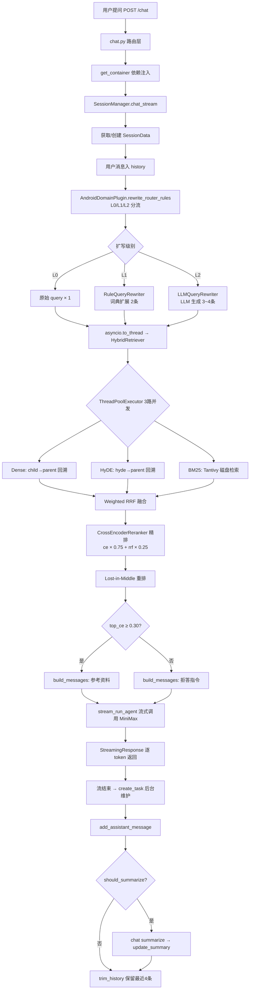

# ai_app1 - Android RAG 问答系统设计文档

> 版本: 3.0 | 最后更新: 2026-05-13

---

## 1. 系统定位

ai_app1 是一个面向 Android 开发者的 **智能问答助手**，基于 RAG (Retrieval-Augmented Generation) 架构构建。系统将《Android 开发核心注意事项与避坑指南》作为知识源，通过多路混合检索为 MiniMax-M2.7 大模型提供精准上下文，回答 Android 开发中的各类技术问题。

**v3.0 核心变化**：完成从单体 ai_app1 到三层架构的迁移。原 ai_app1 内的 service/core/retrieval/eval 代理层已全部删除，业务逻辑下沉至可复用的 `rag_framework` 包，ai_app1 保留为仅负责 HTTP 路由的薄应用层。

---

## 2. 三层架构总览

```
┌─────────────────────────────────────────────────────────┐
│            应用层 (ai_app1/)                              │
│   main.py + api/chat.py  →  FastAPI HTTP 路由            │
│   职责：启动预热、HTTP 接入、RAGContainer 依赖注入         │
└─────────────────────────┬───────────────────────────────┘
                          │  import rag_framework
                          ▼
┌─────────────────────────────────────────────────────────┐
│          领域插件层 (domains/android/)                     │
│   AndroidDomainPlugin  →  Android 领域知识的策略集合       │
│   职责：集合命名、术语词典、查询路由规则、HyDE Prompt        │
└─────────────────────────┬───────────────────────────────┘
                          │  implement DomainPlugin
                          ▼
┌─────────────────────────────────────────────────────────┐
│        框架层 (rag_framework/ — 可安装 Python 包)          │
│   RAGContainer · SessionManager · HybridRetriever       │
│   VectorIndexer · STEmbedder · CrossEncoderReranker     │
│   QueryRewriter · OpenAILLMClient · DenseStore          │
│   职责：通用 RAG 管道的所有实现细节                        │
└─────────────────────────────────────────────────────────┘
```

### 2.1 目录结构

```
fenxiCB/
├── rag_framework/                  # 框架包源码
│   └── rag_framework/
│       ├── container.py            # RAGContainer — 依赖注入总控
│       ├── core/                   # config / logger / registry / exceptions
│       ├── domain/base.py          # DomainPlugin 抽象基类
│       ├── embedding/              # STEmbedder (SentenceTransformer)
│       ├── indexing/               # VectorIndexer / chunker / hyde
│       ├── llm/                    # OpenAILLMClient / tool_registry
│       ├── rerank/                 # CrossEncoderReranker / FallbackReranker
│       ├── retrieval/              # DenseStore / HybridRetriever / sparse
│       │   └── query_rewriter/     # RuleQueryRewriter / LLMQueryRewriter
│       ├── session/                # SessionManager / memory_store
│       └── eval/                   # 评测框架
├── domains/android/
│   ├── android_domain/plugin.py    # AndroidDomainPlugin 实现
│   └── scripts/
│       ├── init_vector_db_v2.py    # 生产索引脚本 (使用 VectorIndexer)
│       └── init_vector_db.py       # V1 轻量验证脚本 (已废弃)
├── ai_app1/                        # 薄应用层
│   ├── main.py                     # FastAPI app + 启动预热
│   ├── api/chat.py                 # /chat 路由 + RAGContainer 注入
│   ├── scripts/                    # 模型下载辅助脚本
│   └── tests/test_api.py           # API 端到端测试
└── doc/
```

---

## 3. 核心组件设计

### 3.1 依赖注入容器 (RAGContainer)

`rag_framework/container.py` 是系统的组装中心，通过 `from_settings()` 工厂方法一次性创建所有组件：

```python
@dataclass
class RAGContainer:
    embedder:      STEmbedder            # BGE-M3 向量编码
    dense_store:   DenseStore            # ChromaDB 持久化存储
    sparse_store:  BM25Store             # Tantivy 磁盘 BM25 索引
    retriever:     HybridRetriever       # 多路召回 + RRF 融合
    reranker:      CrossEncoderReranker  # 语义精排
    llm:           OpenAILLMClient       # MiniMax / OpenAI / Ollama
    session_store: MemorySessionStore    # 会话状态 (内存)
    domain:        DomainPlugin          # Android 领域插件

    @classmethod
    def from_settings(cls, settings: RAGSettings) -> "RAGContainer": ...

    async def chat_stream(self, query: str, user_id: str) -> AsyncGenerator[str, None]:
        # 委托给 SessionManager，async generator 逐 token yield
        manager = SessionManager(self)
        async for chunk in manager.chat_stream(query, user_id):
            yield chunk
```

**ai_app1/api/chat.py** 使用 FastAPI Depends 模式注入：

```python
_container: RAGContainer | None = None

def get_container() -> RAGContainer:
    global _container
    if _container is None:
        _container = RAGContainer.from_settings(get_settings())
    return _container

@router.post("/chat")
async def chat(req: ChatRequest, container: RAGContainer = Depends(get_container)):
    async def content_generator():
        async for chunk in container.chat_stream(req.message, req.user_id):
            yield chunk
    return StreamingResponse(content_generator(), media_type="text/plain")
```

---

### 3.2 配置系统 (RAGSettings)

`rag_framework/core/config.py` 基于 Pydantic BaseSettings，环境变量前缀 `RAG_`：

| 配置项 | 默认值 | 说明 |
|--------|--------|------|
| `llm_backend` | `"minimax"` | 支持 `minimax` / `openai` / `ollama` |
| `llm_base_url` | 按 backend 预设 | minimax: `https://api.minimaxi.com/v1` |
| `llm_model` | 按 backend 预设 | minimax: `MiniMax-M2.7` |
| `llm_api_key` | 回退链解析 | 配置值 → `OPENAI_API_KEY` 环境变量 → backend 默认 |
| `chroma_db_path` | 动态解析 | 先查 `ai_app1/data/chroma_db`（兼容旧路径），否则用 `pre/chroma_db` |
| `bm25_path` | 依 chroma 父目录 | `<chroma_parent>/tantivy_bm25/` |
| `bge_m3_path` | 动态解析 | 查 `models/bge-m3/` 含权重目录 |
| `reranker_model` | 动态解析 | 本地 `models/bge-reranker-base/` 或 HF Hub |

配置加载顺序：`.env` → `ai_app1/.env`（`override=False`，不覆盖已有环境变量）。

**各后端预设：**

| backend | base_url | model |
|---------|----------|-------|
| `minimax` | `https://api.minimaxi.com/v1` | `MiniMax-M2.7` |
| `openai` | `https://api.openai.com/v1` | `gpt-4o-mini` |
| `ollama` | `http://127.0.0.1:11434/v1` | `qwen2.5:1.5b-instruct-q4_K_M` |

---

### 3.3 领域插件系统 (DomainPlugin)

`rag_framework/domain/base.py` 定义抽象接口，将所有 Android 特定知识收敛到 `AndroidDomainPlugin`：

```python
class DomainPlugin(ABC):
    def classify_query(self, query: str, history: list) -> str:
        """返回查询类型：original / semantic / keyword / api"""

    def get_collection_names(self) -> CollectionNames:
        """返回三个 collection 的名称"""
        # android_parent / android_child / android_hyde

    def get_term_mapping(self) -> dict[str, str]:
        """中文术语 → 英文 keyword 映射（L1 规则扩写用）"""

    def rewrite_router_rules(self, query: str, history: list) -> int:
        """返回 0 / 1 / 2 决定扩写级别"""

    def get_hyde_prompt(self, chunk: str) -> str:
        """返回 HyDE 问题生成 Prompt"""
```

**AndroidDomainPlugin 策略**（`domains/android/android_domain/plugin.py`）：

- `classify_query`：检测 Android 组件名（Activity、Fragment、RecyclerView 等）、camelCase、异常命名等代码模式
- `get_collection_names`：`android_parent` / `android_child` / `android_hyde`
- `get_term_mapping`：~25 个高频中文技术词 → 英文 keyword（内存泄漏→memory leak、卡顿→ANR jank 等）
- `rewrite_router_rules`：L0 passthrough / L1 规则扩展 / L2 LLM 重写分级逻辑

---

### 3.4 Embedding 服务 (STEmbedder)

`rag_framework/embedding/sentence_transformer.py`：

- 底层：`sentence_transformers.SentenceTransformer` 加载本地 BGE-M3
- **惰性加载**：首次 `encode()` 时才加载模型
- **L2 归一化**：`normalize_embeddings=True`
- **分批编码**：`batch_size=32`，可设 `None` 关闭
- 全局单例，避免重复加载

---

### 3.5 离线索引构建

#### 3.5.1 VectorIndexer（统一索引编排器）

`rag_framework/indexing/indexer.py` 封装完整的三路索引管道：

```python
@dataclass
class IndexConfig:
    chunk_size:       int  = 512   # parent chunk 大小
    overlap:          int  = 64    # parent overlap
    child_chunk_size: int  = 128   # child chunk 大小
    child_overlap:    int  = 25    # child overlap
    enable_child:     bool = True  # 是否生成 child collection
    enable_hyde:      bool = True  # 是否生成 HyDE questions
    enable_bm25:      bool = True  # 是否写入 BM25 索引

@dataclass
class IndexStats:
    total_files:    int
    total_chunks:   int
    hyde_generated: int
    errors:         list[str]
```

**索引流程：**

```
文档输入 (文件路径 / 内存文本)
    │
    ▼
chunker.chunk_text(size=512, overlap=64)  →  parent chunks + UUID
    │
    ├──▶ DenseStore.add_batch(parent collection)    ← 语义向量
    ├──▶ BM25Store.add_documents(doc_id, text)       ← 关键词索引
    │
    ├──▶ [enable_child] chunk_text(size=128, overlap=25) per parent
    │         child_id = {parent_id}_c{index}
    │         metadata: {parent_id: ...}
    │         DenseStore.add_batch(child collection)
    │
    └──▶ [enable_hyde] generate_hyde_questions(chunks, batch=8)
              asyncio.gather() 并发生成
              DenseStore.add_batch(hyde collection)
```

**公共入口：**
- `index_files(file_paths, on_progress?)` — 适合批量文件
- `index_texts(texts, on_progress?)` — 适合内存数据

#### 3.5.2 HyDE 问题生成

`rag_framework/indexing/hyde.py`：

- `generate_hyde_questions(chunks, llm, domain, batch_size=8)` — async 函数
- `asyncio.gather()` 并发生成，控制 LLM 并发压力
- 错误处理：单 chunk 失败返回空字符串，不中断整体
- 三级清洗：去 `<think>` 标签 → 提取有效问题行 → 降级解析含问号行

#### 3.5.3 Chunker

`rag_framework/indexing/chunker.py`：

```
按段落分割 → 超长段落按句分割（正则：(?<=[。！？!?])）→ 带 overlap 滑动窗口
```

优先保持段落完整性，避免语义断裂。

#### 3.5.4 初始化脚本

| 脚本 | 位置 | 用途 | 状态 |
|------|------|------|------|
| `init_vector_db_v2.py` | `domains/android/scripts/` | 生产索引（parent+child+hyde+bm25），130 行，使用 VectorIndexer | **推荐** |
| `init_vector_db.py` | `domains/android/scripts/` | V1 轻量验证（parent-only，78 行） | 已废弃 |

**V2 CLI 参数：**

```bash
uv run python -m domains.android.scripts.init_vector_db_v2 \
    [--data-dir PATH]   # 文档目录（默认 ai_app1/data）
    [--reset]           # 清空已有集合重建
    [--no-hyde]         # 跳过 HyDE 问题生成
```

---

### 3.6 混合检索管道 (HybridRetriever)

`rag_framework/retrieval/fusion.py` 实现四级检索架构：

```
查询扩写 (QueryRewriter)
    │
    ▼
三路并发召回 (ThreadPoolExecutor, max_workers=3)
    ├── 路A Dense:  child collection → parent 回溯
    ├── 路B HyDE:   hyde collection  → parent 回溯
    └── 路C BM25:   Tantivy 磁盘索引
    │
    ▼
Weighted RRF 融合
    │
    ▼
CrossEncoder 精排
    │
    ▼
Lost-in-Middle 重排
    │
    ▼
低置信度兜底 (top_ce < 0.30 → 拒答指令)
```

#### 3.6.1 父子回溯机制

Dense 与 HyDE 两路均在细粒度 collection（child/hyde）做向量检索，从命中的 `metadata.parent_id` 聚合去重，按子文档最小距离对父文档排序，拉取 `android_parent` 的完整文本作上下文。

```python
# 距离阈值过滤 + 多命中加分
max_child_distance = 1.3
parent_score = min(distance) - 0.05 * (hit_count - 1)
```

- `DENSE_QUERY_K=25`（child 候选） → `DENSE_TOP_K=10`（parent 结果）
- `HYDE_TOP_K=5`

**降级策略**：若 child/hyde collection 不存在，直接查 parent collection（`max_distance=1.2`，`n_results=5`）。

#### 3.6.2 BM25 稀疏检索 (Tantivy + jieba)

`rag_framework/retrieval/sparse.py`：

```
jieba.cut(text) → 空格连接 token 串 → Tantivy whitespace 分词器 → BM25Plus 评分
```

| 方面 | Tantivy + jieba（当前） |
|------|------------------------|
| 百万文档内存 | ~几十 MB（热点 mmap block） |
| 冷启动延迟 | 毫秒级（打开已有索引） |
| 中文分词 | jieba 精确模式 |
| BM25 计算 | Rust（~10× Python 速度） |
| 持久化 | 磁盘（`tantivy_bm25/`） |

**Schema 设计：**

```python
doc_id   : TEXT, stored, tokenizer=raw        # 精确 ID 存取
body     : TEXT, stored, tokenizer=whitespace  # jieba 预分词后存入
raw_text : TEXT, stored, tokenizer=raw        # 原始文本，命中后返回
```

#### 3.6.3 查询扩写与路由 (QueryRewriter)

**三级分流**（`AndroidDomainPlugin.rewrite_router_rules()`）：

| Level | 触发条件 | 实现类 | 耗时 |
|-------|---------|--------|------|
| **L0** 直通 | 短 query，无代词/模糊词 | — (passthrough) | ~0ms |
| **L1** 规则扩展 | 命中中文→英文术语词典 | `RuleQueryRewriter` | ~1ms |
| **L2** LLM 重写 | 含代词/模糊词/长 query/短追问 | `LLMQueryRewriter` | ~1500ms |

**RuleQueryRewriter**（`retrieval/query_rewriter/rule_rewriter.py`）：
- 输出：`[original (w=1.0)] + [keyword (w=0.85, routes=[bm25,dense])]`
- 仅在命中至少一个术语时输出扩写

**LLMQueryRewriter**（`retrieval/query_rewriter/llm_rewriter.py`）：
- 携带最近 4 条对话历史（每条截取 80 字）
- 生成 2~3 条独立检索 query（解决指代/上下文依赖）
- 在独立线程+事件循环中运行，避免嵌套 event loop
- 15 秒超时，失败降级为原始 query
- 输出：`[original(1.0)] + [semantic(0.90, 0.80, 0.70)]`

**QueryRoute 元数据：**

```python
@dataclass
class QueryRoute:
    text:   str        # 扩写后的查询文本
    type:   str        # "original" | "semantic" | "keyword" | "api"
    weight: float      # Weighted RRF 权重
    routes: list[str]  # 允许的召回路径子集
```

**Weighted RRF：**

```python
score(d) = Σ weight_i / (rank_i + RRF_K)   # RRF_K = 60
```

#### 3.6.4 并发召回延迟对比

| 阶段 | 串行 | 并发 |
|------|------|------|
| Dense | ~90ms | — |
| HyDE | ~90ms | — |
| BM25 | ~5ms | — |
| **三路合计** | **~185ms** | **~90ms** |

#### 3.6.5 Rerank 精排

**CrossEncoderReranker**（`rerank/cross_encoder.py`）：

```python
# 1. CrossEncoder.predict([query, doc]) → logits
# 2. ce_prob = sigmoid(logit)
# 3. final_score = 0.75 * ce_norm + 0.25 * rrf_norm
```

- 线程安全：`threading.Lock` 序列化 `predict()` 调用
- 降级：CrossEncoder 失败 → FallbackReranker

**FallbackReranker**（`rerank/fallback.py`）：

```python
# 中英混合分词：[一-鿿]{1,2}|[a-zA-Z0-9]+
final_score = 0.80 * (rrf_score / max_rrf) + 0.20 * token_overlap
```

#### 3.6.6 Lost-in-Middle 重排

```
输入: [rank1, rank2, rank3, rank4, rank5]
输出: [rank1, rank3, rank4, rank5, rank2]
```

最相关→首位，次相关→末位，其余居中。

#### 3.6.7 低置信度兜底

| top_ce 值 | 行为 |
|-----------|------|
| `≥ 0.30` | 正常喂参考资料给 LLM |
| `< 0.30` | 追加拒答指令，告知超出知识库范围 |
| 完全无召回 | 同拒答路径 |

`LOW_CONFIDENCE_CE_THRESHOLD = 0.30`（可通过环境变量调整）。

---

### 3.7 会话管理 (SessionManager)

`rag_framework/session/manager.py`：

```python
class SessionManager:
    async def chat_stream(self, query: str, user_id: str) -> AsyncGenerator[str, None]:
        session = self._get_or_create(user_id)
        session.add_user_message(query)

        # 查询扩写 + 混合检索（asyncio.to_thread 避免阻塞事件循环）
        meta = await asyncio.to_thread(self._retrieve, query, session.history)

        # 构建 messages（system + summary + history + 参考资料/拒答指令）
        messages = self._build_messages(session, meta)

        # 流式生成
        full_reply = ""
        async for chunk in self.llm.stream_run_agent(messages):
            yield chunk
            full_reply += chunk

        # 流结束后后台维护
        asyncio.create_task(self._maintain(session, full_reply))

    async def _maintain(self, session, reply):
        session.add_assistant_message(reply)
        if session.should_summarize():
            summary = await self.llm.chat(summarize_prompt(session))
            session.update_summary(summary)
        session.trim_history()  # 保留最近 MAX_HISTORY=4 条
```

**SessionData 结构：**

```python
class SessionData(TypedDict):
    history:      list        # 最近对话 (role/content)
    summary:      str         # 历史压缩摘要
    trimmed:      list        # 被裁剪的旧消息（不丢弃）
    token_budget: int         # 剩余 token 预算 (4096)
```

**Token 估算（加权字符数）：**

```python
# 中文（含全角标点）~1.5 token/字；英文/代码 ~0.5 token/字符
cn_chars    = len(re.findall(r"[一-鿿　-〿＀-￯]", text))
other_chars = len(text) - cn_chars
tokens      = int(cn_chars * 1.5 + other_chars * 0.5)
```

---

### 3.8 LLM 客户端 (OpenAILLMClient)

`rag_framework/llm/openai_client.py`：

| 方法 | 用途 | 流式 |
|------|------|------|
| `chat(messages)` | 普通对话 / summarize | 否 |
| `stream_run_agent(messages)` | **生产主入口**：流式工具增强多轮对话 | 是 |

**MiniMax 兼容三参数：**

```python
stream_kwargs["max_tokens"] = LLM_MAX_TOKENS          # 512
stream_kwargs["extra_body"] = {
    "max_completion_tokens": LLM_MAX_TOKENS,
    "tokens_to_generate":   LLM_MAX_TOKENS,
}
```

**Tool Calling 流式循环：**

```python
async for chunk in response:
    delta = chunk.choices[0].delta
    if delta.content:
        yield delta.content                 # 实时 yield 给客户端
    if delta.tool_calls:
        # 增量拼接 tool_call → 执行工具 → 追加结果 → 下一轮
```

最多 `MAX_STEPS=10` 轮。

---

### 3.9 应用层 (ai_app1)

#### 3.9.1 main.py — 启动预热

```python
@app.on_event("startup")
async def preload_models():
    container = get_container()
    container.embedder._ensure_model()          # BGE-M3 (~3-5s)
    container.reranker._ensure_model()          # CrossEncoder (~2-3s)
    await asyncio.to_thread(container.sparse_store.search, "", 1)  # BM25 索引
    # LLMQueryRewriter 后端按需预热
```

#### 3.9.2 api/chat.py — HTTP 接入

```python
class ChatRequest(BaseModel):
    message: str
    user_id: str = "default_user"

@router.post("/chat")
async def chat(req: ChatRequest, container: RAGContainer = Depends(get_container)):
    async def content_generator():
        async for chunk in container.chat_stream(req.message, req.user_id):
            yield chunk
    return StreamingResponse(content_generator(), media_type="text/plain")
```

#### 3.9.3 tests/test_api.py — API 测试

- pytest 9.0.3 + pytest-asyncio 1.3.0
- 7 个测试函数：健康检查、SSE 流式、输入校验、用户隔离、CORS
- `unittest.mock.patch("ai_app1.api.chat.get_container")` 隔离 RAGContainer
- 无外部依赖，可在 CI 中运行

```bash
uv run pytest ai_app1/tests/test_api.py -v
```

---

## 4. 完整数据流



---

## 5. 关键配置参考

| 配置项 | 默认值 | 所在位置 |
|--------|--------|----------|
| `llm_backend` | `minimax` | `core/config.py` |
| `llm_model` | `MiniMax-M2.7` | `core/config.py` |
| `LLM_MAX_TOKENS` | `512` | `llm/openai_client.py` |
| `MAX_HISTORY` | `4` | `session/manager.py` |
| `DEFAULT_TOKEN_BUDGET` | `4096` | `session/manager.py` |
| `RRF_K` | `60` | `retrieval/fusion.py` |
| `MAX_CHILD_DISTANCE` | `1.3` | `retrieval/fusion.py` |
| `DENSE_QUERY_K` | `25` | `retrieval/fusion.py` |
| `DENSE_TOP_K` | `10` | `retrieval/fusion.py` |
| `HYDE_TOP_K` | `5` | `retrieval/fusion.py` |
| `BM25_TOP_K` | `10` | `retrieval/fusion.py` |
| `RERANK_TOP_K` | `3` | `retrieval/fusion.py` |
| `LOW_CONFIDENCE_CE_THRESHOLD` | `0.30` | `retrieval/fusion.py` |
| `IndexConfig.chunk_size` | `512` | `indexing/indexer.py` |
| `IndexConfig.child_chunk_size` | `128` | `indexing/indexer.py` |
| `IndexConfig.enable_child` | `True` | `indexing/indexer.py` |
| `IndexConfig.enable_hyde` | `True` | `indexing/indexer.py` |

---

## 6. 运行流程

### 6.1 首次部署

```bash
# 1. 安装依赖（含 rag_framework 本地包）
uv sync

# 2. 配置环境变量
cp ai_app1/.env.example ai_app1/.env
# 编辑 .env: OPENAI_API_KEY=your_minimax_key

# 3. 构建离线索引（生产 V2）
uv run python -m domains.android.scripts.init_vector_db_v2

# 4. 启动服务（自动预热所有模型）
uv run python -m ai_app1.main
```

### 6.2 开发调试

```bash
# 本地源码安装（editable，修改立即生效）
uv pip install -e rag_framework/

# 运行 API 测试
uv run pytest ai_app1/tests/test_api.py -v

# 查看 rewrite 缓存命中率
curl http://localhost:8000/debug/rewrite_cache
```

### 6.3 API 调用

```bash
curl -X POST http://localhost:8000/chat \
  -H "Content-Type: application/json" \
  -d '{"message": "Android 中 Handler 内存泄漏怎么解决？"}'
```

---

## 7. 设计决策记录

| 决策 | 选择 | 理由 |
|------|------|------|
| 包结构 | rag_framework 独立可安装包 | 与 ai_app2/ai_app3 共用框架；隔离领域逻辑与通用逻辑 |
| 领域知识 | DomainPlugin 插件系统 | 集合命名/术语词典/路由规则/HyDE Prompt 等领域特异性内容统一收敛，框架零耦合 |
| DI 模式 | RAGContainer.from_settings() + FastAPI Depends | 一次组装，全请求复用；可测试（mock 注入） |
| Embedding | BGE-M3 (本地 STEmbedder) | 中文语义效果优、L2 normalize、显式编码便于缓存和换模型 |
| 向量库 | ChromaDB | 本地持久化、零配置、Python 原生 |
| LLM | MiniMax-M2.7（默认） | 中文能力强、OpenAI 格式兼容 |
| 检索架构 | 三路并发混合检索 | Dense 精度 + HyDE 覆盖 + BM25 关键词，三路互补；ThreadPoolExecutor 并发 ~90ms |
| 父子回溯 | child 检索 → parent 上下文 | 细粒度匹配提升精度，大粒度 parent 保证上下文连贯性 |
| BM25 引擎 | Tantivy (Rust) + jieba | mmap 磁盘索引内存占用小；Rust BM25 ~10× Python；jieba 分词精度高 |
| 查询扩写 | 三级路由 L0/L1/L2 | 80% 简单 query 不需 LLM；规则路由 1ms 分流，平均耗时 1500ms → ~300ms |
| Reranker | CrossEncoder (bge-reranker-base) | 语义相关性打分优于规则线性；sigmoid 归一化后与 RRF 同区间；FallbackReranker 作降级 |
| 低置信度兜底 | ce_score 阈值 0.30 | 复用 reranker 输出无额外开销；明确拒答比基于不相关片段硬答更有价值 |
| 索引编排 | VectorIndexer 统一管道 | 消除 init 脚本与框架的重复逻辑（chunking/HyDE/batch 写入），300 行 → 130 行 |
| 会话存储 | 内存字典 | 进程级简单实现，重启后丢失（可扩展至 Redis） |
| 流式响应 | AsyncGenerator + StreamingResponse | 用户首 token 即可见，TTFT 最优；后台 create_task 维护 session |
| max_tokens 兼容 | max_tokens + extra_body 三参数 | MiniMax 对 OpenAI SDK max_tokens 解析不完全兼容，三参数兜底 |
| 包安装模式 | editable install 推荐 | 非 editable 安装时源码修改不反映到运行时，开发期需 `pip install -e .` |

---

## 8. 已知风险与缓解措施

### 8.1 检索去重（A）

**风险**：三路召回命中同一 Parent 导致重复内容。  
**缓解**：`seen_ids: set[str]` 候选去重；`rerank_chunks()` 后运行时断言。

### 8.2 CrossEncoder 线程安全（B）

**风险**：HF fast tokenizer (Rust RefCell) 不允许并发调用。  
**缓解**：`BgeRerankerService` 内 `threading.Lock` 序列化 `predict()` 调用。

### 8.3 冷启动延迟（C）

**风险**：BGE-M3 ~3-5s、CrossEncoder ~2-3s、Ollama qwen2.5 ~10-15s。  
**缓解**：`preload_models()` 启动时预热所有组件，首用户请求到达时已就绪。

### 8.4 rag_framework 版本漂移（D）

**风险**：非 editable 安装时源码修改不自动反映到 venv，导致源码与运行时不一致。  
**缓解**：开发期使用 `uv pip install -e rag_framework/`（editable mode）；生产部署后更新源码需重新安装。

### 8.5 Session 竞争条件（E）

**风险**：流式传输期间用户发第二条请求，`build_messages()` 可能读到旧 history。  
**缓解**：当前单用户场景影响低；长期方案：asyncio.Lock 保护 session 读写。

### 8.6 知识库外问题幻觉（F）✅ 已修复

**风险**：用户问范围外的问题（iOS 开发等），LLM 在不相关片段上硬答。  
**修复**：`top_ce < 0.30` 时追加拒答指令，不喂参考片段。

### 8.7 LLM Rewrite 成本超过检索（G）✅ 已修复

**风险**：100% 走 LLM rewrite 时 ~1.5s 占 TTFT 60%+。  
**修复**：三级分流 L0/L1/L2，平均耗时 ~300ms，简单 query 0~1ms。

### 8.8 MiniMax max_tokens 兼容（H）✅ 已修复

**风险**：MiniMax 不完全兼容 OpenAI SDK 的 `max_tokens` 字段，实测超长输出。  
**修复**：三参数同发 `max_tokens + max_completion_tokens + tokens_to_generate`。

### 8.9 Summarize 上下文断裂（I）

**风险**：长跨度对话中关键报错被压缩为模糊摘要。  
**缓解**：保留最近 4 条原始消息；未来可考虑结构化摘要（保留代码/堆栈片段）。

---

## 9. 版本变更记录

| 版本 | 日期 | 变更内容 |
|------|------|----------|
| v3.0 | 2026-05-13 | **三层架构重构**：rag_framework 独立包 + AndroidDomainPlugin + 薄应用层；删除 ai_app1 代理层；VectorIndexer 统一索引管道；RuleQueryRewriter / LLMQueryRewriter 提取为框架组件；FallbackReranker 独立组件；DenseStore 新增 get_or_create_collection；pytest 测试套件 |
| v2.7 | 2026-05-12 | Rewrite Router 三级分流（L0/L1/L2）；低置信度兜底（top_ce<0.30）；Ollama 集成；LLM max_tokens 兼容修复；RERANK_TOP_K 5→3；`/debug/rewrite_cache` 监控 |
| v2.6 | 2026-05-12 | Query Rewrite + Retrieval Orchestration：RewriteQuery(text,type,weight,routes) + Weighted RRF |
| v2.5 | 2026-05-11 | CrossEncoder 语义重排；API 全面流式化；session 后台异步维护；启动预热 |
| v2.4 | 2026-05-10 | 三路并发召回（ThreadPoolExecutor）；Dense 聚合优化；RRF + term_overlap 方案 A |
| v2.2 | 2026-05-08 | 修复 AsyncOpenAI 客户端；删除冗余实例化；修复 summarize 输入格式；修复硬编码路径 |
| v2.0 | 2026-05-06 | Parent-Child 架构 + HyDE + BM25 多路混合检索 |
| v1.0 | 2026-05-04 | 初始版本：单路向量检索 + 基础会话管理 |
