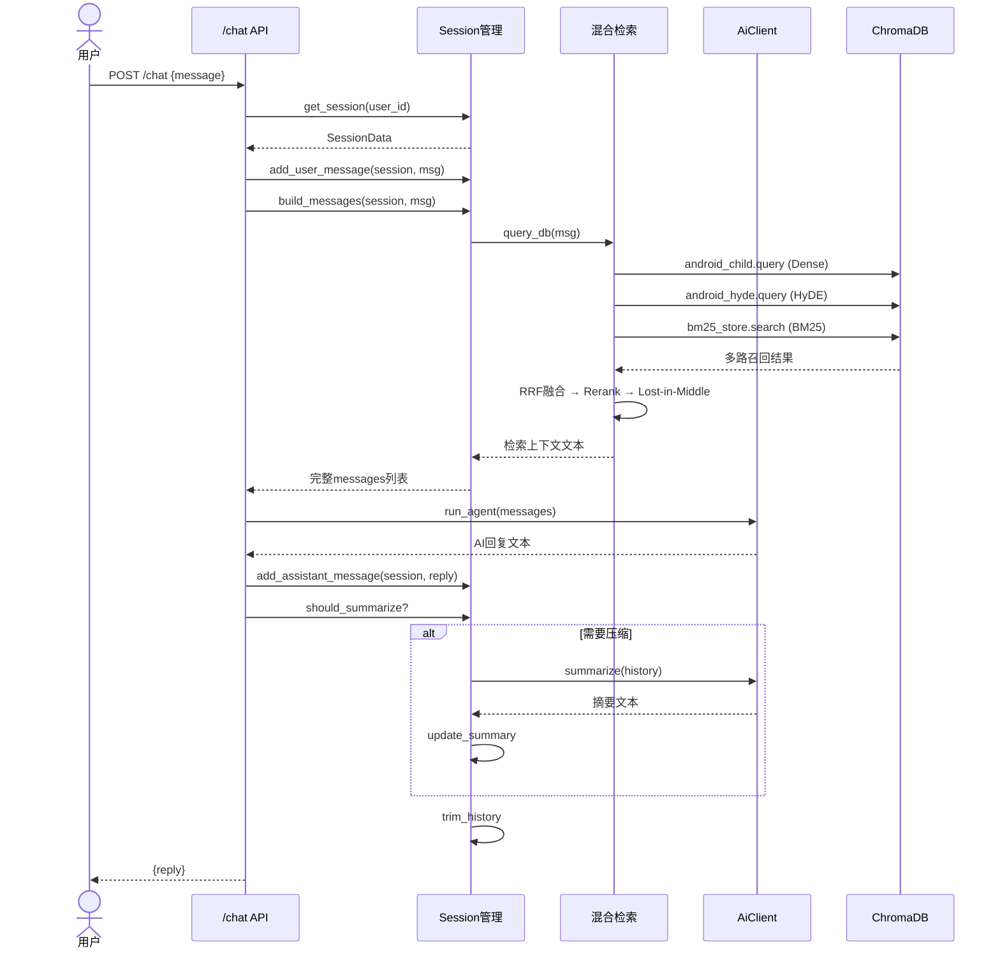
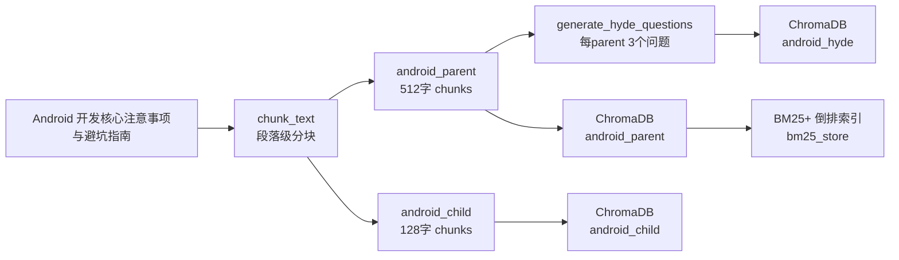
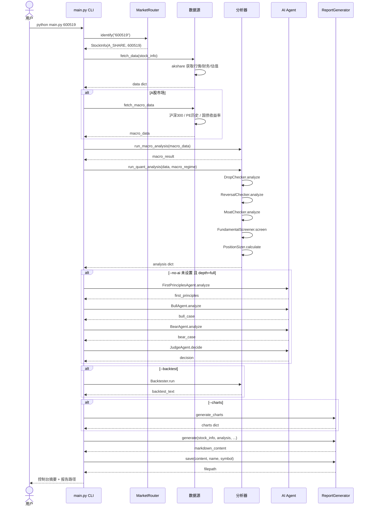
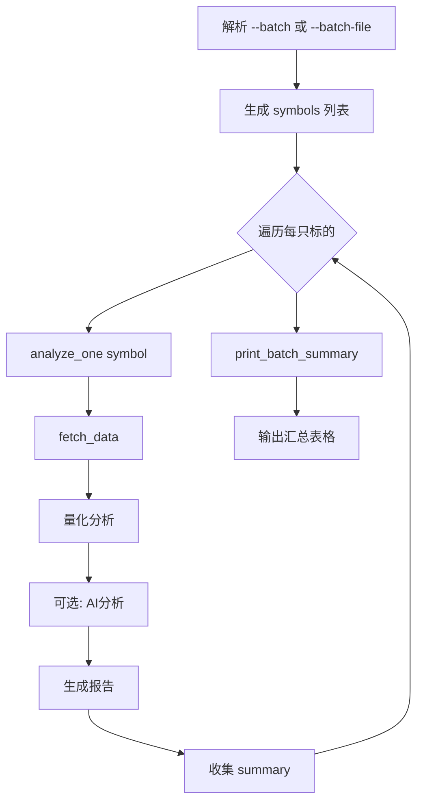
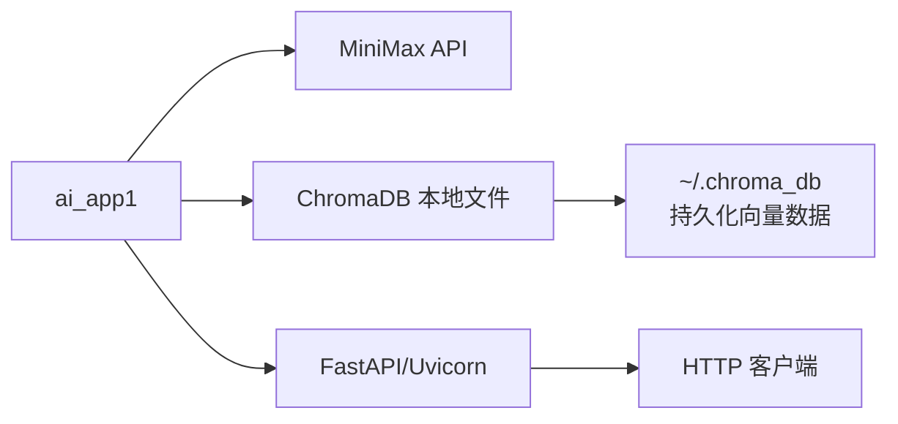
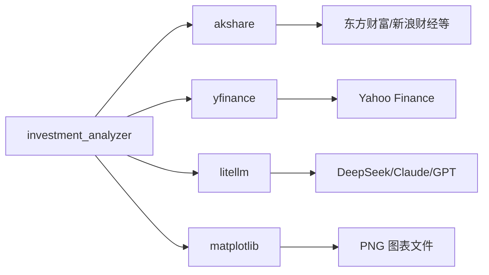

# 数据流与模块交互文档

> 版本: 1.0 | 最后更新: 2026-05-08

---

## 1. 全局模块关系图

```
┌──────────────────────────────────────────────────────────────────────────────┐
│                            AnalyzerGP 项目                                    │
│                              pyproject.toml                                    │
│                              uv.lock                                           │
└──────┬─────────────────────────┬─────────────────────────────────────────────┘
       │                         │
       ▼                         ▼
┌───────────────┐       ┌───────────────────────┐
│   ai_app1     │       │   investment_analyzer │
│  (RAG 问答)    │       │   (投资分析工作流)     │
│               │       │                       │
│ FastAPI 服务  │       │ CLI 工具              │
│ 独立运行       │       │ 独立运行              │
└───────┬───────┘       └───────────┬───────────┘
        │                           │
        │    ┌─────────────────┐    │
        └───►│  共享依赖层      │◄───┘
             │  - pandas       │
             │  - numpy        │
             │  - httpx        │
             │  - pydantic     │
             └─────────────────┘
             ┌─────────────────┐
             │  无共享运行时状态 │
             │  无共享数据存储  │
             │  无共享配置     │
             └─────────────────┘
```

---

## 2. ai_app1 内部数据流

### 2.1 请求生命周期



### 2.2 离线索引构建流程



---

## 3. investment_analyzer 内部数据流

### 3.1 单次分析完整流程



### 3.2 批量分析流程



---

## 4. 子系统间交互说明

### 4.1 共享内容

| 共享项 | 说明 |
|--------|------|
| Python 解释器 | >=3.13 |
| 包管理器 | uv |
| 部分依赖包 | pandas, numpy, httpx, pydantic |

### 4.2 隔离内容

| 隔离项 | ai_app1 | investment_analyzer |
|--------|---------|---------------------|
| 入口 | FastAPI HTTP 服务 | CLI 脚本 |
| 配置 | `ai_app1/core/config.py` + `.env` | `investment_analyzer/config.py` |
| 数据存储 | ChromaDB (向量数据库) | 文件系统缓存 + 输出目录 |
| LLM 客户端 | openai SDK → MiniMax | litellm → 多模型 |
| 日志 | `ai_app1/core/logger.py` | print + 内置 logging |
| 运行方式 | `uv run python -m ai_app1.main` | `cd investment_analyzer && python main.py` |

### 4.3 无直接依赖

两个子系统之间 **没有任何 import 关系**，可以独立部署、独立运行。它们仅在同一个 Git 仓库中共享根目录的 `pyproject.toml` 进行依赖管理。

---

## 5. 外部依赖交互

### 5.1 ai_app1 外部依赖



### 5.2 investment_analyzer 外部依赖



---

## 6. 数据持久化

### 6.1 ai_app1

| 数据 | 位置 | 格式 | 生命周期 |
|------|------|------|----------|
| 向量索引 | `CHROMA_DB_PATH` (绝对路径) | ChromaDB 持久化文件 | 长期 |
| 会话状态 | 内存 (`user_sessions` dict) | Python dict | 进程级 |
| 日志 | stdout (通过 logging) | 文本 | 运行时 |

### 6.2 investment_analyzer

| 数据 | 位置 | 格式 | 生命周期 |
|------|------|------|----------|
| 分析报告 | `output/{symbol}_{name}_{date}.md` | Markdown | 长期 |
| 数据缓存 | `output/.cache/` | pickle/JSON | 4小时 TTL |
| 观察名单 | `output/watchlist.json` | JSON | 长期 |
| 监控日志 | `output/monitor_log.jsonl` | JSON Lines | 追加 |
| 图表 | `output/{symbol}_*_date.png` | PNG | 长期 |

---

## 7. 配置管理

### 7.1 ai_app1 配置

```python
# core/config.py
OPENAI_API_KEY = os.getenv("OPENAI_API_KEY")          # MiniMax API Key
CHROMA_DB_PATH = "/Users/.../chroma_db"               # 向量库路径（硬编码绝对路径）
```

环境变量通过 `.env` 文件加载：
```bash
OPENAI_API_KEY=sk-...
```

### 7.2 investment_analyzer 配置

全部配置集中在 `config.py`，分层管理：

```python
LLM_CONFIG       # 模型选择 / API Key / temperature
DATA_CONFIG      # 缓存目录 / TTL
ANALYSIS_CONFIG  # 各分析器阈值
LAYER0_CONFIG    # 宏观定轨参数
LAYER2_CONFIG    # 基本面筛选阈值
POSITION_CONFIG  # 仓位管理参数
REPORT_CONFIG    # 输出目录 / 语言
```

---

## 8. 错误处理与降级策略

### 8.1 ai_app1

| 场景 | 降级策略 |
|------|----------|
| v2 collections 不存在 | 回退旧版 `android_docs` 单路检索 |
| 检索无结果 | 返回 None，不附加参考资料 |
| LLM API 异常 | 抛出异常，FastAPI 返回 500 |
| summarize 失败 | 不更新 summary，不影响对话继续 |

### 8.2 investment_analyzer

| 场景 | 降级策略 |
|------|----------|
| A股数据获取失败 | 返回空 data，跳过分析 |
| 美股/港股数据失败 | 同上 |
| 宏观数据失败 | 返回空 macro_data，regime=ambiguous |
| LLM 调用失败 | 捕获异常，跳过 AI 分析阶段 |
| matplotlib 未安装 | 跳过图表生成 |
| 数据列名不匹配 | 多列名尝试匹配，失败则标记 pending |
