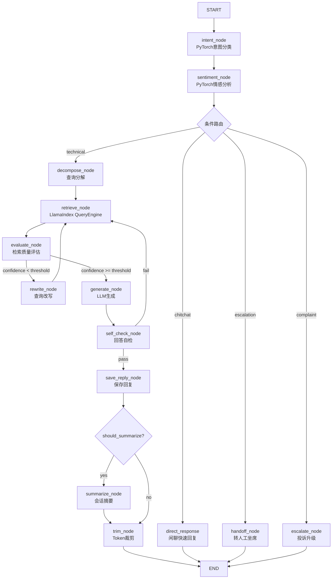

# ai_app4 商业化客服系统架构演进方案

> 基于现有 AnalyzerGP（fenxicb）项目架构分析，为 ai_app4 规划兼容性重构路线。

---

## 一、技术选型确认

| 技术 | 定位 | 与现有架构关系 |
|------|------|---------------|
| **LlamaIndex** | 替代自研 HybridRetriever，作为一级检索后端 | `rag_framework` 新增 `LlamaIndexRetriever` 实现 `Retriever` 接口 |
| **PyTorch** | 轻量任务模型（意图分类、情感分析、NER） | 新增 `rag_framework/torch_models/` 层，通过 transformers pipeline 或 torchserve 调用 |
| **LangGraph** | ai_app4 核心编排框架 | 独立构建，不继承 ai_app3 代码，但参考其状态图设计模式 |
| **FastAPI** | Web 服务层 | 端口 8004，新增 WebSocket + SSE 双通道 |

---

## 二、现有架构兼容性缺口分析

### 2.1 检索层缺口

现有 `Retriever.retrieve()` 返回 `RetrievalResult(docs: list[RetrievedDoc])`，而 LlamaIndex `QueryEngine.query()` 返回 `Response` 对象（含 `source_nodes` + 合成后的 `response` 文本）。两者语义不同：

- **现有**：仅召回文档片段，由上层 LLM 自行合成回答
- **LlamaIndex**：可在检索后内部进行 Response Synthesis（如 `compact` / `tree_summarize` / `refine`）

**影响**：若 ai_app4 需要 LlamaIndex 的 Response Synthesis 能力，现有 `Retriever` 抽象需要扩展或新增 `QueryEngine` 抽象。

### 2.2 索引结构缺口

现有 `VectorStore` 抽象仅支持 `get_collection` / `query` / `add` 等操作，面向 ChromaDB 的 Collection 模型。LlamaIndex 的索引结构更丰富：

- `VectorStoreIndex` — 向量检索
- `SummaryIndex` — 全文顺序遍历
- `KeywordTableIndex` — 关键词映射
- `TreeIndex` — 层次化摘要树
- `KnowledgeGraphIndex` — 知识图谱

**影响**：需要新增 `IndexBuilder` / `IndexDescription` 抽象，让 `DomainPlugin` 能描述 LlamaIndex 索引配置。

### 2.3 配置系统缺口

`RAGSettings` 当前无 LlamaIndex 和 PyTorch 相关配置段：

```python
# 缺失配置
llamaindex_index_dir: str
llamaindex_index_type: Literal["vector", "summary", "keyword", "tree", "kg"]
llamaindex_response_mode: str        # compact / tree_summarize / refine / no_text
llamaindex_similarity_top_k: int
llamaindex_enable_hybrid: bool       # LlamaIndex 自身 hybrid search

# PyTorch 模型配置
torch_device: str
torch_intent_model_path: str
torch_sentiment_model_path: str
torch_ner_model_path: str
torch_cache_dir: str
```

### 2.4 PyTorch 任务模型缺口

当前 `rag_framework` 无任何 PyTorch 模型抽象。商业化客服至少需要：

1. **意图分类** — 将用户消息分类为 `technical_question` / `complaint` / `escalation_request` / `chitchat`
2. **情感分析** — 判断用户情绪（愤怒/焦虑/满意），触发转人工或安抚话术
3. **命名实体识别** — 提取订单号、产品名、手机号等关键信息
4. **Query Rewriter** — 已存在，但当前是 LLM-based，PyTorch 可做轻量规则改写

### 2.5 多租户与持久化缺口

商业化客服核心需求当前均未覆盖：

| 需求 | 现状 | 缺口 |
|------|------|------|
| 多租户知识库隔离 | 单 `active_domain` 配置 | 无 tenant_id 维度 |
| 会话持久化 | `MemorySessionStore` | 无 PostgreSQL/Redis/MongoDB 实现 |
| 用户认证 | 无 | 无 JWT/OAuth2 中间件 |
| 人工坐席接管 | 无 | 无 WebSocket 消息桥接 |
| 运营监控 | 日志 + `FailureCollector` | 无 Metrics/Alerting 体系 |

---

## 三、rag_framework 重构方案

### 3.1 新增模块结构

```
rag_framework/
├── ...existing modules...
├── llamaindex/              # NEW: LlamaIndex 适配层
│   ├── __init__.py
│   ├── base.py              # LlamaIndexRetriever implements Retriever
│   ├── index_config.py      # IndexDescription, IndexType
│   ├── index_builder.py     # 从 DomainPlugin 描述构建索引
│   └── factories.py         # register_llamaindex_retriever
├── torch_models/            # NEW: PyTorch 轻量任务模型层
│   ├── __init__.py
│   ├── base.py              # TorchTaskModel ABC
│   ├── registry.py          # 模型注册表（非工厂模式，独立生命周期）
│   ├── intent_classifier.py
│   ├── sentiment_analyzer.py
│   └── entity_recognizer.py
├── persistence/             # NEW: 持久化存储抽象
│   ├── __init__.py
│   ├── base.py              # PersistentSessionStore ABC
│   ├── postgres_store.py
│   ├── redis_store.py
│   └── mongo_store.py
└── auth/                    # NEW: 认证抽象（可选，也可放在 ai_app4）
    ├── __init__.py
    └── base.py              # AuthProvider ABC
```

### 3.2 LlamaIndexRetriever 设计

```python
class LlamaIndexRetriever(Retriever):
    """
    LlamaIndex QueryEngine 的 Retriever 接口适配器。

    策略：
      - 若 DomainPlugin 启用 response_synthesis，则返回合成后的文本作为 RetrievedDoc
      - 否则仅返回 source_nodes 作为 RetrievedDoc 列表（与现有 HybridRetriever 行为一致）
    """

    def __init__(
        self,
        settings: RAGSettings,
        embedder: Embedder,           # 复用现有 BGE-M3
        index_description: IndexDescription,
        response_mode: str = "no_text",  # 默认不做合成，保持与现有架构一致
    ) -> None:
        ...

    async def retrieve(self, query: str | QueryRoute | list[QueryRoute], top_k: int = 10) -> RetrievalResult:
        # 将 QueryRoute 翻译为 LlamaIndex 的查询参数
        # 通过 asyncio.to_thread 卸载 QueryEngine.query()
        ...
```

### 3.3 TorchTaskModel 设计

```python
class TorchTaskModel(ABC):
    """PyTorch 轻量任务模型抽象基类。"""

    @property
    @abstractmethod
    def task_name(self) -> str:
        """任务标识，如 intent_classification / sentiment_analysis / ner"""
        ...

    @abstractmethod
    def load(self, model_path: str, device: str = "auto") -> None:
        """加载模型权重（惰性加载）"""
        ...

    @abstractmethod
    async def predict(self, text: str, **kwargs) -> dict:
        """异步推理，返回结构化结果"""
        ...

    def warmup(self) -> None:
        """预热模型，避免首请求延迟"""
        ...
```

### 3.4 配置系统扩展

在 `RAGSettings` 中新增配置段（保持 `extra="ignore"`，不影响旧配置）：

```python
# ── LlamaIndex ──────────────────────────────────────────────────────
llamaindex_enabled: bool = False
llamaindex_index_dir: str = Field(default_factory=_default_llamaindex_path)
llamaindex_index_type: str = "vector"
llamaindex_response_mode: str = "no_text"
llamaindex_similarity_top_k: int = 10
llamaindex_enable_hybrid: bool = False

# ── PyTorch Models ──────────────────────────────────────────────────
torch_device: str = "auto"
torch_intent_model_path: str = ""
torch_sentiment_model_path: str = ""
torch_ner_model_path: str = ""
torch_cache_dir: str = Field(default_factory=_default_torch_cache_path)
```

### 3.5 工厂注册表扩展

```python
# rag_framework/core/factories.py 新增
llamaindex_retriever_registry = _Registry[Any]("llamaindex_retriever")
torch_model_registry = _Registry[Any]("torch_model")
persistence_registry = _Registry[Any]("persistence")
```

---

## 四、ai_app4 独立架构蓝图

### 4.1 目录结构

```
ai_app4/
├── main.py                    # FastAPI 入口，端口 8004
├── lifespan.py                # 生命周期：加载容器 → 预热 → 关闭
├── api/
│   ├── __init__.py
│   ├── chat.py               # POST /chat (SSE) + /chat/ws (WebSocket)
│   ├── admin.py              # 知识库管理、索引重建、模型热更新
│   ├── tenant.py             # 多租户 CRUD、知识库隔离配置
│   └── agent.py              # 人工坐席：接管、转接、消息中继
├── core/
│   ├── __init__.py
│   ├── config.py             # CS4Settings extends RAGSettings
│   ├── container.py          # CS4Container extends RAGContainer
│   ├── auth.py               # JWT / OAuth2 认证中间件
│   ├── events.py             # 事件总线（asyncio.Queue + 广播）
│   └── permissions.py        # RBAC 权限模型
├── graph/
│   ├── __init__.py
│   ├── state.py              # CS4State extends RagState
│   ├── builder.py            # LangGraph StateGraph 构建
│   ├── nodes/
│   │   ├── __init__.py
│   │   ├── intent.py         # 意图分析（PyTorch 意图分类）
│   │   ├── sentiment.py      # 情感分析（PyTorch 情感模型）
│   │   ├── ner.py            # 实体提取（PyTorch NER）
│   │   ├── retrieve.py       # LlamaIndex QueryEngine 检索
│   │   ├── evaluate.py       # 检索质量自评估（复用 ai_app3 逻辑）
│   │   ├── escalate.py       # 转人工判断（基于情感 + 意图 + 置信度）
│   │   ├── generate.py       # LLM 生成（注入客服话术风格）
│   │   ├── self_check.py     # 回答自检（复用 ai_app3）
│   │   ├── handoff.py        # 坐席交接（写入事件总线）
│   │   ├── summarize.py      # 会话摘要（复用 ai_app3）
│   │   └── trim.py           # Token 预算裁剪（复用 ai_app3）
│   └── conditional_edges.py  # 条件路由逻辑
├── service/
│   ├── __init__.py
│   ├── llamaindex_engine.py  # LlamaIndex QueryEngine 包装与缓存
│   ├── torch_service.py      # PyTorch 模型推理统一入口
│   ├── tenant_manager.py     # 多租户管理（内存 + DB）
│   ├── agent_bridge.py       # 人工坐席 WebSocket 桥接
│   └── monitor.py            # 运营监控（延迟、命中率、转人工率）
├── models/                    # 数据库 ORM 模型（SQLAlchemy 2.0）
│   ├── __init__.py
│   ├── tenant.py             # 租户表
│   ├── session.py            # 会话持久化表
│   ├── message.py            # 消息历史表
│   └── agent.py              # 坐席表
├── static/                    # 客服管理后台（React/Vue）
└── tests/
    ├── __init__.py
    ├── test_api.py            # API 端到端测试
    ├── test_graph.py          # LangGraph 节点测试
    └── test_torch.py          # PyTorch 模型推理测试
```

### 4.2 LangGraph 状态图设计



### 4.3 多租户检索隔离

```python
class CS4Container(RAGContainer):
    """
    ai_app4 扩展容器，支持多租户隔离的检索器实例。
    """
    
    def get_retriever(self, tenant_id: str) -> Retriever:
        """按租户获取隔离的检索器实例（带缓存）。"""
        ...
    
    def get_torch_model(self, task_name: str) -> TorchTaskModel:
        """按任务名获取 PyTorch 模型实例。"""
        ...
```

---

## 五、DomainPlugin 演进方案

### 5.1 向后兼容的扩展

现有 `DomainPlugin` 保持不变，新增可选属性：

```python
class DomainPlugin(ABC):
    # ... 现有属性不变 ...

    @property
    def llamaindex_config(self) -> LlamaIndexConfig | None:
        """
        LlamaIndex 索引配置描述。
        
        返回 None 表示该领域不使用 LlamaIndex（兼容旧实现）。
        """
        return None

    @property
    def torch_tasks(self) -> list[TorchTaskConfig]:
        """
        该领域需要的 PyTorch 任务模型列表。
        
        默认空列表，表示不需要 PyTorch 模型（兼容旧实现）。
        """
        return []

    @property
    def tenant_enabled(self) -> bool:
        """该领域是否支持多租户模式。"""
        return False
```

### 5.2 新增 LlamaIndexConfig

```python
@dataclass(frozen=True)
class LlamaIndexConfig:
    """LlamaIndex 索引配置描述。"""
    index_type: str = "vector"           # vector | summary | keyword | tree | kg
    doc_paths: list[str] = field(default_factory=list)
    persist_dir: str = ""
    response_mode: str = "no_text"       # no_text | compact | tree_summarize
    similarity_top_k: int = 10
    enable_hybrid: bool = False
    node_parser: dict = field(default_factory=dict)  # 分块参数
```

---

## 六、实施优先级与 TODO 清单

### Phase 1：rag_framework 基础扩展（最高优先级）

- [ ] **新增 `rag_framework/llamaindex/base.py`** — `LlamaIndexRetriever` 实现 `Retriever` 接口
- [ ] **新增 `rag_framework/llamaindex/index_config.py`** — `IndexDescription` / `LlamaIndexConfig`
- [ ] **新增 `rag_framework/torch_models/base.py`** — `TorchTaskModel` 抽象基类
- [ ] **扩展 `RAGSettings`** — 新增 LlamaIndex + PyTorch 配置段
- [ ] **扩展工厂注册表** — 新增 `llamaindex_retriever_registry` / `torch_model_registry`
- [ ] **扩展 `DomainPlugin`** — 新增 `llamaindex_config` / `torch_tasks` 可选属性

### Phase 2：ai_app4 骨架搭建

- [ ] **创建 `ai_app4/` 目录结构**
- [ ] **实现 `ai_app4/core/config.py`** — `CS4Settings` 继承 `RAGSettings`
- [ ] **实现 `ai_app4/core/container.py`** — `CS4Container` 扩展 `RAGContainer`
- [ ] **实现 `ai_app4/lifespan.py`** — FastAPI lifespan（容器预热 + LlamaIndex 索引加载）
- [ ] **实现 `ai_app4/api/chat.py`** — SSE 流式接口（复用 ai_app3 的 trace + content 双通道）

### Phase 3：LangGraph 状态图实现

- [ ] **实现 `ai_app4/graph/state.py`** — `CS4State` 定义
- [ ] **实现意图分析节点** — 调用 PyTorch 意图分类模型
- [ ] **实现情感分析节点** — 调用 PyTorch 情感模型
- [ ] **实现检索节点** — 调用 LlamaIndex QueryEngine
- [ ] **实现转人工判断节点** — 基于情感 + 意图 + 置信度综合决策
- [ ] **实现生成节点** — 注入客服话术风格
- [ ] **实现坐席交接节点** — 写入事件总线

### Phase 4：PyTorch 模型集成

- [ ] **实现 `rag_framework/torch_models/intent_classifier.py`**
- [ ] **实现 `rag_framework/torch_models/sentiment_analyzer.py`**
- [ ] **实现 `rag_framework/torch_models/entity_recognizer.py`**
- [ ] **实现 `ai_app4/service/torch_service.py`** — 统一推理入口 + 批处理优化
- [ ] **编写模型训练/微调脚本** — 放在 `ai_app4/scripts/finetune_*.py`

### Phase 5：商业化功能（中优先级）

- [ ] **实现多租户管理** — `ai_app4/service/tenant_manager.py` + 数据库模型
- [ ] **实现会话持久化** — PostgreSQL / Redis `PersistentSessionStore`
- [ ] **实现用户认证** — JWT / OAuth2 中间件
- [ ] **实现人工坐席桥接** — WebSocket 消息中继 + 接管/转接
- [ ] **实现运营监控** — Metrics 采集 + 转人工率 / 平均响应延迟 / 用户满意度

### Phase 6：索引与部署（低优先级）

- [ ] **实现 LlamaIndex 索引构建脚本** — `domains/android/scripts/build_llamaindex.py`
- [ ] **支持 LlamaIndex 多索引类型** — Vector / Summary / Keyword / Tree / KG
- [ ] **Docker 化部署** — `docker-compose.yml`（FastAPI + PostgreSQL + Redis）
- [ ] **性能基准测试** — LlamaIndex vs 现有 HybridRetriever 对比

---

## 七、关键架构决策总结

| 决策 | 选择 | 理由 |
|------|------|------|
| **LlamaIndex 集成方式** | 适配器模式（`LlamaIndexRetriever implements Retriever`） | 保持 `rag_framework` 抽象层稳定，ai_app4 可无缝替换检索后端 |
| **PyTorch 模型生命周期** | 独立于工厂注册表，通过 `torch_model_registry` 管理 | 任务模型不是 RAG 组件，需要独立的加载/预热/释放生命周期 |
| **ai_app4 与 ai_app3 关系** | 完全独立，参考但不继承 | ai_app3 是 Agentic RAG 实验层，ai_app4 是商业化产品层，解耦避免历史包袱 |
| **多租户隔离粒度** | 每租户独立 LlamaIndex persist_dir + 独立检索器实例 | 保证知识库严格隔离，避免数据泄露风险 |
| **Response Synthesis 默认** | `no_text`（关闭合成） | 保持与现有架构一致，让 LLM 节点控制回答生成；后续可按领域开启 |
| **认证层位置** | 放在 `ai_app4` 而非 `rag_framework` | `rag_framework` 保持纯技术框架，商业化功能在应用层实现 |

---

## 八、风险与缓解

| 风险 | 缓解措施 |
|------|---------|
| LlamaIndex 引入后依赖体积增大 | `rag_framework` 的 LlamaIndex 模块使用惰性 import，ai_app1/2/3 不触发加载 |
| PyTorch 模型加载导致首请求延迟 | `Warmupable` 协议扩展至 `TorchTaskModel`，lifespan 统一预热 |
| 多租户检索器实例过多导致内存爆炸 | 实现 LRU 缓存 + 租户检索器池化，限制最大并发实例数 |
| LlamaIndex 索引构建耗时过长 | 索引构建作为后台任务（Celery / APScheduler），不影响 API 服务 |
| 旧 DomainPlugin 未实现新属性导致异常 | 所有新增属性均有默认值（`None` / `[]` / `False`），向后兼容 |

---

*方案版本: v1.0*
*最后更新: 2026-05-16*
