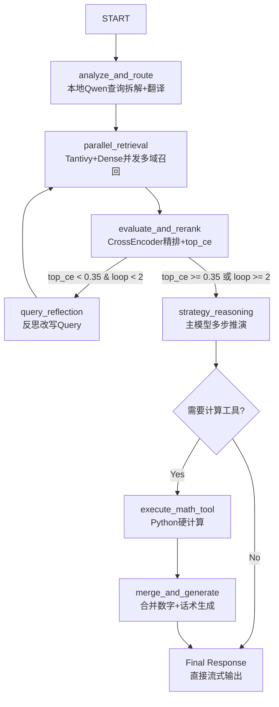

# ai_app4 — Wealth AI Agent v4.0 实施计划

> 基于 `doc/需求文档.md` 设计的全球资产与宏观经济多步推演智能助理实施方案。
> 版本: v1.0 | 日期: 2026-05-17

---

## 一、架构决策（多方辩论结论）

| 决策点 | 选择 | 理由 |
|--------|------|------|
| 是否保留 ai_app4 骨架 | ✅ 保留 | `main.py`、`lifespan.py`、`core/*`、`api/chat.py` 是通用 FastAPI + DI 基础设施，与业务无关 |
| 图编排层如何处理 | 🔄 彻底重写 | `graph/` 目录完全替换为 Wealth AI 的 7 节点 + 4 条件边拓扑，移除客服专属节点 |
| 是否依赖 ai_app3 | ❌ 不直接依赖 | 参考 ai_app3 的 `decompose_node`、`tool_calling` 设计模式，但代码独立编写，避免历史包袱 |
| 领域插件位置 | `domains/wealth/` | 复用 `DomainPlugin` 抽象，定义 `macro_econ` + `corp_earnings` 双域 |
| 数学工具挂载方式 | Python 硬函数 + `tool_registry` | 凯利公式、网格交易计算器注册到 `rag_framework.llm.tool_registry`，LLM 通过 JSON 调用 |

---

## 二、LangGraph 状态图拓扑



### 节点清单

| 节点 | 职责 | 状态写入 |
|------|------|---------|
| `analyze_and_route` | 本地 Qwen 提取特征、中英文 Query 拆解、生成 sub_queries | `sub_queries`, `rewritten_queries`, `trace` |
| `parallel_retrieval` | 并发检索 macro_econ / corp_earnings / all，Tantivy + Dense 召回 | `retrieved_context`, `retrieval_iterations` |
| `evaluate_and_rerank` | CrossEncoder 精排，提取真实 top_ce | `confidence`, `top_ce`, `evaluation_result` |
| `query_reflection` | Qwen 反思未命中原因，金融术语化改写 | `user_message`（改写后）, `trace` |
| `strategy_reasoning` | 主模型（MiniMax）多步推演，识别是否需要工具 | `reply`（中间思考）, `needs_tool`, `tool_calls` |
| `execute_math_tool` | 从 tool_call 提取参数，调用 Python 硬计算 | `tool_results`, `math_result` |
| `merge_and_generate` | 合并计算结果与 LLM 话术，生成严谨金融报告 | `reply`（最终回复） |

### 条件边清单

| 条件边 | 判断逻辑 | 分支 |
|--------|---------|------|
| `after_analyze` | sub_queries 数量 > 1 时走多路，否则单路 | `parallel_retrieval`（统一） |
| `after_evaluate` | `top_ce < 0.35` 且 `loop < max_loop` → reflection，否则 → strategy | `query_reflection` / `strategy_reasoning` |
| `after_strategy` | `needs_tool == True` → tool，否则 → final | `execute_math_tool` / `merge_and_generate` |
| `after_tool` | 工具执行后必须合并生成 | `merge_and_generate` |

---

## 三、四阶段实施路线图

### 阶段一：骨架迁移（Week 1）

目标：不加任何新知识，先用 LangGraph 把现有能力框起来。

| # | 任务 | 文件 | 说明 |
|---|------|------|------|
| 1-1 | 重构 `graph/state.py` | `ai_app4/graph/state.py` | `CS4State` → `WealthState`，适配投资分析字段 |
| 1-2 | 重构 `graph/builder.py` | `ai_app4/graph/builder.py` | 按 Wealth AI 拓扑重建 StateGraph |
| 1-3 | 实现基础节点 | `ai_app4/graph/nodes.py` | `analyze_and_route`, `parallel_retrieval`, `generate` |
| 1-4 | 实现条件边 | `ai_app4/graph/conditional_edges.py` | `after_analyze`, `after_evaluate`, `after_strategy`, `after_tool` |
| 1-5 | 调整 API | `ai_app4/api/chat.py` | 适配 WealthState 的 SSE 流式输出 |
| 1-6 | 调整配置 | `ai_app4/core/config.py` | 新增 Wealth AI 专属配置段 |
| 1-7 | 验证骨架 | — | 启动 ai_app4，测试基础聊天链路无报错 |

### 阶段二：数据录入与跨域融合（Week 2-3）

目标：让资料库丰富起来，打通中英文混合路由。

| # | 任务 | 文件 | 说明 |
|---|------|------|------|
| 2-1 | 创建 Wealth 领域插件 | `domains/wealth/` | `WealthDomainPlugin` + `macro_econ`/`corp_earnings` 双域 |
| 2-2 | 编写索引构建脚本 | `domains/wealth/scripts/init_wealth_db.py` | 支持 PDF/Markdown 录入，标记 domain |
| 2-3 | 增强查询拆解 | `ai_app4/graph/nodes.py` | Qwen 中英文 Query 拆解与派发 |
| 2-4 | 增强并发检索 | `ai_app4/graph/nodes.py` | 按 domain 路由并融合结果 |
| 2-5 | 录入测试数据 | — | 2-3 份财报 + 美联储纪要，构建索引 |

### 阶段三：自旋锁反思机制（Week 4-5）

目标：不浪费任何线上坏 Case，卡死 RAG 底层质量。

| # | 任务 | 文件 | 说明 |
|---|------|------|------|
| 3-1 | 实现评估节点 | `ai_app4/graph/nodes.py` | 复用 `FallbackReranker` 提取真实 `top_ce` |
| 3-2 | 实现反思节点 | `ai_app4/graph/nodes.py` | Qwen 金融术语化改写 |
| 3-3 | 完善条件边 | `ai_app4/graph/conditional_edges.py` | `top_ce < 0.35` 且 `loop < max` 时循环 |
| 3-4 | 接入 Trace | — | `retrieval_trace.py` + `latency_breakdown.py` 在 Graph 模式下工作 |

### 阶段四：挂载计算工具箱（Week 6+）

目标：让 Agent 具备真正的行动力，完成商业级闭环。

| # | 任务 | 文件 | 说明 |
|---|------|------|------|
| 4-1 | 数学工具函数 | `ai_app4/service/tools.py` | `kelly_criterion_calc`, `grid_trading_cost_estimator` |
| 4-2 | 注册工具 | `rag_framework.llm.tool_registry` | LLM 可感知并 JSON 调用 |
| 4-3 | 策略推演节点 | `ai_app4/graph/nodes.py` | 主模型识别是否需要计算工具 |
| 4-4 | 工具执行节点 | `ai_app4/graph/nodes.py` | 提取参数，调用 Python 函数 |
| 4-5 | 合并生成节点 | `ai_app4/graph/nodes.py` | 合并数字与话术，生成严谨报告 |
| 4-6 | 端到端测试 | — | 复合大题验证完整工具调用链路 |

---

## 四、关键风险与缓解

| 风险 | 缓解措施 |
|------|---------|
| 中英文 Query 拆解质量不稳定 | 先用规则+LLM 混合，后续可训练专用模型 |
| `top_ce` 阈值 0.35 可能过严/过松 | 配置化 `reflection_threshold`，可运行时调整 |
| 数学工具参数提取幻觉 | 严格 JSON Schema 校验 + 参数范围检查 |
| 跨领域检索结果融合冲突 | 按 `weight` 字段加权排序 + 去重 |
| 索引为空时系统崩溃 | 所有检索节点增加空结果兜底，graceful degradation |

---

## 五、 WealthState 字段定义

```python
class WealthState(TypedDict):
    # 用户输入
    user_message: str
    user_id: str

    # 分析与改写（analyze_and_route 写入）
    sub_queries: list[dict]           # [{"text": "...", "domain": "macro_econ", "weight": 1.0}]
    rewritten_queries: list[str]      # 改写后的查询列表

    # 检索（parallel_retrieval 写入）
    retrieved_context: str | None     # 合并后的检索上下文
    retrieval_iterations: int         # 已检索次数（防无限循环）

    # 评估（evaluate_and_rerank 写入）
    confidence: float                 # 综合置信度
    top_ce: float                     # CrossEncoder 最高分（核心阈值依据）
    evaluation_result: dict | None    # 评估详情

    # 策略推演（strategy_reasoning 写入）
    needs_tool: bool                  # 是否需要执行数学工具
    tool_calls: list[dict]            # 待执行的工具调用描述

    # 工具执行（execute_math_tool 写入）
    tool_results: list[Any]           # 工具执行原始结果
    math_result: dict | None          # 结构化数学结果

    # 生成（merge_and_generate / generate 写入）
    reply: str                        # 最终回复文本

    # 会话历史
    history: list[dict]               # 对话历史
    summary: str                      # 历史摘要
    token_budget: int                 # 剩余 token 预算
    messages: list                    # LangChain Message 对象

    # 可观测性
    trace: list[dict]                 # 全链路执行轨迹
```

---

*本计划经多方架构辩论后确定，作为 ai_app4 Wealth AI Agent v4.0 的完整实施蓝图。*
